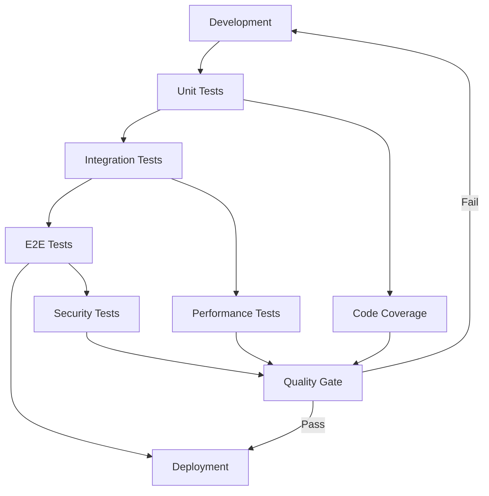

# Memory Bank System for Claude Code v2.0 - Enterprise Edition

**A comprehensive task management system optimized for Claude Code with Clean Architecture principles, maintainable code practices, and enterprise-grade quality assurance.**

---

## 🚀 Quick Start

### Core Development Modes
1. **VAN** - Project initialization and complexity analysis
2. **PLAN** - Strategic implementation planning with architecture focus
3. **CREATIVE** - Design decisions and architectural exploration
4. **IMPLEMENT** - Clean code implementation with TDD
5. **REFLECT** - Code review and quality assessment  
6. **ARCHIVE** - Documentation and knowledge preservation

### 🏃‍♂️ TURBO Mode (All-in-One Execution)
Execute complete development workflows automatically:
```
TURBO [task description]
```

### 🧹 CLEAN Mode (Code Quality Focus)
Specialized mode for code quality improvement:
```
CLEAN [focus area: architecture|testing|refactoring|documentation]
```

---

## 🏗️ Clean Architecture & Code Quality Features

### Code Quality Principles Integration

#### SOLID Principles Enforcement
- **Single Responsibility**: Each component has one reason to change
- **Open/Closed**: Open for extension, closed for modification
- **Liskov Substitution**: Derived classes must be substitutable
- **Interface Segregation**: Clients shouldn't depend on unused interfaces
- **Dependency Inversion**: Depend on abstractions, not concretions

#### Clean Code Standards
- **Meaningful Names**: Clear, searchable, pronounceable naming
- **Function Design**: Small, single-purpose functions with descriptive names
- **Comment Guidelines**: Code that explains itself with minimal comments
- **Error Handling**: Proper exception handling without obscuring logic
- **Consistent Formatting**: Automated formatting and style consistency

#### Architectural Patterns
- **Domain-Driven Design**: Clear domain boundaries and ubiquitous language
- **Hexagonal Architecture**: Isolation of business logic from external concerns
- **CQRS/Event Sourcing**: Separation of read/write operations where appropriate
- **Repository Pattern**: Abstraction of data access logic
- **Factory Pattern**: Object creation encapsulation

### Testing Strategy Integration

#### Test-Driven Development (TDD)
- **Red-Green-Refactor Cycle**: Failing test → Implementation → Refactoring
- **Test First Approach**: Tests drive design and implementation
- **Refactoring Safety**: Comprehensive test coverage enables safe refactoring

#### Testing Pyramid
```
    E2E Tests (Few)
   ┌─────────────┐
  Integration Tests (Some)
 ┌───────────────────┐
Unit Tests (Many)
┌─────────────────────────┐
```

- **Unit Tests**: Fast, isolated, covering business logic
- **Integration Tests**: Component interaction validation
- **E2E Tests**: User journey validation

#### Test Quality Standards
- **AAA Pattern**: Arrange → Act → Assert
- **Descriptive Test Names**: Clear intent and expected behavior
- **Test Independence**: No test dependencies or shared state
- **Mock Strategy**: Strategic use of mocks for external dependencies

### Code Quality Metrics

#### Static Analysis Integration
- **Code Coverage**: Minimum 80% for critical paths
- **Cyclomatic Complexity**: Maximum 10 per function
- **Code Duplication**: Maximum 3% duplication ratio
- **Technical Debt**: Tracked and prioritized for resolution

#### Performance Considerations
- **Big O Analysis**: Algorithm complexity documentation
- **Memory Management**: Proper resource cleanup and optimization
- **Caching Strategy**: Intelligent caching for frequently accessed data
- **Database Optimization**: Query optimization and indexing strategies

---

## 🎯 Complexity-Based Workflows

### Level 1: Quick Fix (Bug Fixes)
**Workflow**: VAN → IMPLEMENT → REFLECT
- **Focus**: Minimal invasive changes with comprehensive testing
- **Quality Gates**: Unit tests, regression testing, code review
- **Documentation**: Minimal but clear change documentation

### Level 2: Enhancement (Feature Extensions)
**Workflow**: VAN → PLAN → IMPLEMENT → REFLECT → ARCHIVE
- **Focus**: Maintain existing architecture while adding functionality
- **Quality Gates**: Integration tests, performance validation, compatibility checks
- **Architecture Review**: Ensure changes align with existing patterns

### Level 3: Feature Development (New Features)
**Workflow**: VAN → PLAN → CREATIVE → IMPLEMENT → REFLECT → ARCHIVE
- **Focus**: Clean implementation with proper abstraction layers
- **Quality Gates**: Full test suite, architectural review, security assessment
- **Design Patterns**: Apply appropriate design patterns for maintainability

### Level 4: System Enhancement (Major Changes)
**Workflow**: VAN → PLAN → CREATIVE → IMPLEMENT → REFLECT → ARCHIVE
- **Focus**: Enterprise-grade implementation with full documentation
- **Quality Gates**: Performance benchmarks, scalability testing, security audit
- **Architecture Evolution**: Consider system-wide impact and future extensibility

---

## 🔧 CLEAN Mode Specifications

### Architecture Focus (`CLEAN architecture`)
- **Layer Separation**: Clear boundaries between presentation, business, and data layers
- **Dependency Analysis**: Review and optimize dependency relationships
- **Interface Design**: Define clear contracts between components
- **Abstraction Review**: Evaluate abstraction levels and complexity

### Testing Focus (`CLEAN testing`)
- **Test Coverage Analysis**: Identify and address coverage gaps
- **Test Quality Review**: Evaluate test maintainability and clarity
- **Testing Strategy**: Optimize test pyramid and execution speed
- **Mock Usage Review**: Evaluate mock strategy effectiveness

### Refactoring Focus (`CLEAN refactoring`)
- **Code Smell Detection**: Identify and address common anti-patterns
- **Extraction Opportunities**: Method, class, and interface extraction
- **Simplification**: Reduce complexity while maintaining functionality
- **Performance Optimization**: Identify and address performance bottlenecks

### Documentation Focus (`CLEAN documentation`)
- **API Documentation**: Comprehensive interface documentation
- **Architecture Decision Records**: Document significant architectural choices
- **Code Comments**: Review and improve inline documentation
- **Knowledge Transfer**: Ensure knowledge is transferable to team members

---

## 🧪 Testing & Quality Assurance

### Automated Testing Integration


### Quality Gates
- **Code Coverage**: Minimum thresholds for different test types
- **Performance Benchmarks**: Response time and throughput requirements
- **Security Scanning**: Vulnerability assessment and dependency auditing
- **Code Quality Metrics**: Complexity, duplication, and maintainability scores

### Continuous Integration
- **Pre-commit Hooks**: Code formatting, linting, and basic tests
- **Build Pipeline**: Automated testing and quality checks
- **Deployment Gates**: Quality validation before production deployment
- **Monitoring**: Runtime quality metrics and error tracking

---

## 📁 Project Structure Standards

### Clean Architecture Structure
```
project/
├── src/
│   ├── domain/          # Business logic (entities, use cases)
│   ├── application/     # Application services and interfaces
│   ├── infrastructure/  # External dependencies (DB, APIs)
│   └── presentation/    # Controllers, views, APIs
├── tests/
│   ├── unit/           # Unit tests
│   ├── integration/    # Integration tests
│   └── e2e/           # End-to-end tests
├── docs/
│   ├── architecture/   # Architecture documentation
│   ├── api/           # API documentation
│   └── decisions/     # Architectural Decision Records
└── tools/
    ├── scripts/       # Build and deployment scripts
    └── config/        # Configuration files
```

### File Organization Principles
- **Single Responsibility**: One class per file, clear naming
- **Logical Grouping**: Related components in same directories
- **Separation of Concerns**: Clear boundaries between layers
- **Discoverability**: Intuitive navigation and file location

---

## 🛡️ Security & Maintainability

### Security Best Practices
- **Input Validation**: Comprehensive validation of all inputs
- **Authentication & Authorization**: Proper access control implementation
- **Data Protection**: Encryption of sensitive data at rest and in transit
- **Dependency Security**: Regular security audits of third-party dependencies

### Long-term Maintainability
- **Code Readability**: Self-documenting code with clear intent
- **Consistent Patterns**: Established patterns followed throughout codebase
- **Refactoring Support**: Code structure that supports safe refactoring
- **Knowledge Transfer**: Documentation and code that enables team knowledge sharing

### Technical Debt Management
- **Debt Identification**: Regular assessment of technical debt
- **Prioritization**: Risk-based prioritization of debt resolution
- **Tracking**: Visibility into debt accumulation and resolution
- **Prevention**: Practices that prevent debt accumulation

---

## 📊 Metrics & Monitoring

### Code Quality Metrics
- **Cyclomatic Complexity**: Function and class complexity measurement
- **Code Coverage**: Test coverage percentage by component
- **Duplication**: Code duplication percentage and hotspots
- **Maintainability Index**: Overall codebase maintainability score

### Performance Metrics
- **Response Time**: API and user interaction response times
- **Throughput**: Request processing capacity
- **Resource Usage**: Memory and CPU utilization patterns
- **Error Rates**: Error frequency and categorization

### Development Metrics
- **Lead Time**: Time from requirement to production
- **Deployment Frequency**: Release cadence and reliability
- **Mean Time to Recovery**: Recovery time from incidents
- **Change Failure Rate**: Percentage of deployments causing issues

---

## 🔄 Workflow Examples

### Example 1: Bug Fix (Level 1)
```
1. VAN - Analyze bug report and codebase impact
2. IMPLEMENT - Apply minimal fix with comprehensive tests
3. REFLECT - Validate fix effectiveness and side effects
```

### Example 2: Feature Extension (Level 2)
```
1. VAN - Assess feature requirements and integration points
2. PLAN - Design extension strategy maintaining architecture
3. IMPLEMENT - Develop feature with proper testing
4. REFLECT - Review implementation quality and performance
5. ARCHIVE - Document feature and integration points
```

### Example 3: New Feature (Level 3)
```
1. VAN - Analyze requirements and architectural impact
2. PLAN - Design feature architecture and dependencies
3. CREATIVE - Explore design alternatives and patterns
4. IMPLEMENT - Build feature following clean architecture
5. REFLECT - Comprehensive quality review
6. ARCHIVE - Complete documentation and knowledge transfer
```

### Example 4: System Enhancement (Level 4)
```
1. VAN - Enterprise-level analysis and stakeholder alignment
2. PLAN - Comprehensive implementation strategy
3. CREATIVE - Architectural exploration and decision documentation
4. IMPLEMENT - Phased implementation with quality gates
5. REFLECT - System-wide impact assessment
6. ARCHIVE - Enterprise documentation and training materials
```

---

## 🚀 Getting Started

### 1. Project Setup
```bash
# Copy system files to project
cp -r claude-code-enhanced/en/.cursor .
cp -r claude-code-enhanced/en/memory_bank .
cp claude-code-enhanced/en/CLAUDE.md .
```

### 2. Initialize Development
```
VAN
```

### 3. Choose Workflow
- **Quick development**: Use TURBO mode
- **Quality-focused**: Use standard mode progression
- **Code improvement**: Use CLEAN mode

### 4. Quality Validation
```
# Run quality checks
npm run lint
npm run test
npm run coverage
```

---

## 🔧 Configuration

### Quality Gates Configuration
```json
{
  "coverage": {
    "minimum": 80,
    "critical_paths": 95
  },
  "complexity": {
    "max_cyclomatic": 10,
    "max_function_length": 50
  },
  "performance": {
    "max_response_time": 200,
    "min_throughput": 1000
  }
}
```

### Testing Configuration
```json
{
  "testing": {
    "unit_test_pattern": "**/*.test.js",
    "integration_test_pattern": "**/*.integration.test.js",
    "e2e_test_pattern": "**/*.e2e.test.js",
    "coverage_threshold": 80
  }
}
```

---

## 📚 Best Practices Summary

### Development Practices
1. **Test-Driven Development**: Write tests before implementation
2. **Clean Code**: Follow clean code principles consistently
3. **Regular Refactoring**: Continuous code improvement
4. **Code Reviews**: Peer review for quality assurance

### Architecture Practices
1. **Dependency Inversion**: Program to interfaces, not implementations
2. **Single Responsibility**: Each component has one reason to change
3. **Open/Closed Principle**: Open for extension, closed for modification
4. **Interface Segregation**: Small, focused interfaces

### Quality Practices
1. **Automated Testing**: Comprehensive test automation
2. **Continuous Integration**: Automated quality validation
3. **Static Analysis**: Automated code quality assessment
4. **Performance Monitoring**: Runtime quality metrics

### Documentation Practices
1. **Self-Documenting Code**: Code that explains its purpose
2. **API Documentation**: Clear interface documentation
3. **Architecture Decisions**: Document significant choices
4. **Knowledge Sharing**: Transfer knowledge effectively

---

**Memory Bank System v2.0 Enterprise Edition** - Building maintainable, scalable, and high-quality software with Claude Code.