# Memory Bank System v2.0 - Master Configuration

**🌟 Enterprise-Grade Development System for Claude Code with Clean Architecture, Quality Assurance, and Comprehensive Task Management**

---

## 🎯 System Overview

This is the **Master Configuration** for Memory Bank System v2.0 Enterprise Edition - a comprehensive development workflow system designed specifically for Claude Code that integrates:

- **Clean Architecture Principles** and **SOLID Design Patterns**
- **Test-Driven Development** and **Comprehensive Quality Assurance**
- **Automated Workflow Management** with **Intelligence Mode Selection**
- **Code Quality Metrics** and **Long-term Maintainability**
- **Enterprise-Grade Security** and **Performance Standards**

## 🌍 Language Versions

### English (Primary)
**Location**: `./en/CLAUDE.md`
**Target Audience**: International development teams, English-speaking developers
**Features**: Complete feature set with enterprise documentation standards

### Japanese (Secondary)  
**Location**: `./jp/CLAUDE.md`
**Target Audience**: Japanese development teams, localized workflows
**Features**: Full feature parity with Japanese interface and documentation

## 📚 Documentation Structure

### Core Documentation
- **Master Configuration**: `MASTER_CLAUDE.md` (this file)
- **English Version**: `en/README.md` + `en/CLAUDE.md`
- **Japanese Version**: `jp/README.md` + `jp/CLAUDE.md`
- **Complexity Assessment**: `en/COMPLEXITY_ASSESSMENT.md`
- **UI/UX Optimization**: `en/UX_OPTIMIZATION.md`
- **Database Optimization**: `en/DATABASE_OPTIMIZATION.md`

### Integration Files
```
claude-code-enhanced/
├── MASTER_CLAUDE.md          # This master configuration
├── en/                       # English version (primary)
│   ├── README.md            # Complete English documentation
│   ├── CLAUDE.md            # English Claude Code configuration
│   ├── COMPLEXITY_ASSESSMENT.md # Complexity evaluation framework
│   ├── UX_OPTIMIZATION.md   # UI/UX optimization guidelines
│   └── DATABASE_OPTIMIZATION.md # Database performance optimization
├── jp/                       # Japanese version (secondary)
│   ├── README.md            # Complete Japanese documentation
│   └── CLAUDE.md            # Japanese Claude Code configuration
└── shared/                   # Shared resources and templates
    ├── .cursor/             # Claude Code rules and configurations
    ├── memory_bank/         # Task tracking and context management
    └── templates/           # Project templates and scaffolding
```

---

## 🚀 System Capabilities

### Core Development Modes

#### 🔍 VAN (Initialization & Analysis)
- **Project structure analysis** with architecture assessment
- **Complexity level determination** (Level 1-4) with quality requirements  
- **Technology stack evaluation** and recommendations
- **Code quality baseline** establishment
- **Security assessment** and requirements definition

#### 📋 PLAN (Strategic Planning & Architecture)
- **Implementation strategy** with clean architecture principles
- **Dependency mapping** and abstraction layer design
- **Risk assessment** with quality risk mitigation
- **Testing strategy definition** and test planning
- **Performance requirements** and benchmarking plan

#### 🎨 CREATIVE (Design & Architecture Exploration)
- **Architectural pattern exploration** (DDD, Hexagonal, CQRS)
- **Design pattern selection** and implementation strategy
- **Technology choice evaluation** with long-term considerations
- **Component interface design** with SOLID principles
- **Security architecture** and threat modeling

#### ⚒️ IMPLEMENT (Clean Code Implementation)
- **Test-Driven Development (TDD)** implementation
- **Clean code creation** with SOLID principles
- **Comprehensive unit and integration testing**
- **Code review and quality validation**
- **Performance optimization** and profiling

#### 🔍 REFLECT (Quality Review & Assessment)
- **Code quality assessment** and metrics analysis
- **Architecture review** and compliance validation
- **Test coverage analysis** and gap identification
- **Performance benchmarking** and optimization identification
- **Technical debt identification** and prioritization

#### 📦 ARCHIVE (Documentation & Knowledge Preservation)
- **Technical documentation** creation
- **API documentation** and interface specifications
- **Architecture Decision Records (ADRs)**
- **Knowledge base updates** and training materials
- **Deployment and operational documentation**

### Advanced Modes

#### 🏃‍♂️ TURBO (All-in-One Execution)
**Complete workflow automation with quality gates at each phase**

```bash
TURBO [specific task description]
# Examples:
TURBO Add user authentication with JWT and role-based access control
TURBO Optimize database queries and implement caching strategy  
TURBO Refactor legacy payment system with clean architecture
```

**Features**:
- **Intelligent Phase Selection**: Automatically determines required phases based on complexity
- **Quality Gate Integration**: Built-in quality validation at each transition
- **Error Recovery**: Automatic retry and recovery mechanisms
- **Progress Tracking**: Real-time progress indication and status updates

#### 🧹 CLEAN (Code Quality Focus)
**Specialized mode for code quality improvement and technical debt resolution**

```bash
CLEAN architecture    # Focus on architectural improvements
CLEAN testing        # Focus on test quality and coverage
CLEAN refactoring    # Focus on code refactoring and optimization
CLEAN documentation  # Focus on documentation improvements
CLEAN security       # Focus on security improvements  
CLEAN performance    # Focus on performance optimization
```

---

## 🎯 Complexity Assessment System

### Automatic Level Determination

#### Level 1: Quick Fix (Bug Fixes)
- **Scope**: Single function/method changes
- **Workflow**: `VAN → IMPLEMENT → REFLECT`
- **Time**: 1-4 hours
- **Quality**: 90% coverage, complexity ≤ 5

#### Level 2: Enhancement (Feature Extensions)
- **Scope**: Extending existing functionality
- **Workflow**: `VAN → PLAN → IMPLEMENT → REFLECT → ARCHIVE`
- **Time**: 4-16 hours  
- **Quality**: 85% coverage, complexity ≤ 8

#### Level 3: Feature Development (New Features)
- **Scope**: Complete new functionality
- **Workflow**: `VAN → PLAN → CREATIVE → IMPLEMENT → REFLECT → ARCHIVE`
- **Time**: 16-80 hours
- **Quality**: 80% coverage, complexity ≤ 10, architecture review

#### Level 4: System Enhancement (Major Changes)
- **Scope**: System-wide architectural changes
- **Workflow**: `VAN → PLAN → CREATIVE → IMPLEMENT → REFLECT → ARCHIVE + Enterprise Gates`
- **Time**: 80+ hours
- **Quality**: 90% coverage, complexity ≤ 8, security audit, performance benchmarks

### Quality Gates by Level


---

## 🏗️ Clean Architecture Integration

### SOLID Principles Enforcement
- **Single Responsibility**: Each component has one reason to change
- **Open/Closed**: Open for extension, closed for modification  
- **Liskov Substitution**: Derived classes must be substitutable
- **Interface Segregation**: Clients shouldn't depend on unused interfaces
- **Dependency Inversion**: Depend on abstractions, not concretions

### Architectural Patterns
- **Domain-Driven Design**: Clear domain boundaries and ubiquitous language
- **Hexagonal Architecture**: Isolation of business logic from external concerns
- **CQRS/Event Sourcing**: Separation of read/write operations where appropriate
- **Repository Pattern**: Abstraction of data access logic
- **Factory Pattern**: Object creation encapsulation

### Code Quality Standards
```yaml
code_quality:
  naming: clear, searchable, pronounceable
  functions: small, single-purpose (max 50 lines)
  classes: single responsibility principle
  duplication: DRY principle enforcement
  comments: self-documenting code preferred

testing_strategy:
  approach: test-driven development (TDD)
  pyramid: unit (many) → integration (some) → e2e (few)
  coverage: minimum 80% (critical paths 95%)
  independence: no shared state between tests
```

---

## 🛡️ Enterprise Security & Quality

### Security Best Practices
- **Input Validation**: Comprehensive validation of all inputs
- **Authentication & Authorization**: Proper access control implementation
- **Data Protection**: Encryption of sensitive data at rest and in transit
- **Dependency Security**: Regular security audits of third-party dependencies
- **Error Handling**: Secure error handling without information leakage

### Quality Assurance Framework

```mermaid
graph LR
    Code[Code Quality] --> Coverage[Test Coverage]
    Coverage --> Performance[Performance]
    Performance --> Security[Security]
    Security --> Gate[Quality Gate]
    
    Code --> Lint[Linting]
    Code --> Complexity[Complexity Analysis]
    Coverage --> Unit[Unit Tests]
    Coverage --> Integration[Integration Tests]
    Performance --> Benchmarks[Benchmarks]
    Performance --> Load[Load Tests]
    Security --> Audit[Security Audit]
    Security --> Vulnerability[Vulnerability Scan]
    
    Gate --> Pass[✅ Pass]
    Gate --> Fail[❌ Fail]
```


### Performance Standards
- **Response Time**: < 200ms for API endpoints
- **Throughput**: Minimum 1000 requests/second  
- **Memory Usage**: Efficient memory management and cleanup
- **Database**: Optimized queries and proper indexing
- **Caching**: Strategic caching implementation

---

## 📁 Project Structure Standards

### Recommended Directory Structure
```
project/
├── .claude/                 # Claude Code Memory Bank
│   ├── rules/              # System rules and configurations
│   └── memory_bank/        # Task tracking and context management
├── src/
│   ├── domain/             # Business logic (entities, use cases)
│   ├── application/        # Application services and interfaces  
│   ├── infrastructure/     # External dependencies (DB, APIs)
│   └── presentation/       # Controllers, views, APIs
├── tests/
│   ├── unit/              # Unit tests
│   ├── integration/       # Integration tests
│   └── e2e/              # End-to-end tests
├── docs/
│   ├── architecture/      # Architecture documentation
│   ├── api/              # API documentation
│   └── decisions/        # Architectural Decision Records (ADRs)
├── tools/
│   ├── scripts/          # Build and deployment scripts
│   └── config/           # Configuration files
├── .gitignore            # Version control exclusions
├── CLAUDE.md            # Memory Bank configuration
└── README.md            # Project documentation
```

---

## 🚀 Getting Started

### 1. Choose Your Language Version
**English (Primary)**:
```bash
cp -r claude-code-enhanced/en/* .
```

**Japanese (Secondary)**:
```bash
cp -r claude-code-enhanced/jp/* .
```

### 2. Initialize Memory Bank
```bash
# Copy shared resources
cp -r claude-code-enhanced/shared/.claude .
cp -r claude-code-enhanced/shared/memory_bank .
```

### 3. Start Development
```bash
# Initialize project analysis
VAN

# Or use TURBO for complete automation
TURBO [your task description]
```

### 4. Quality Validation
```bash
# Run comprehensive quality checks
npm run lint
npm run test  
npm run coverage
npm run security-scan
npm run benchmark
```

---

## 🔧 Configuration Examples

### Quality Gates Configuration
```json
{
  "quality_gates": {
    "level_1": {
      "coverage_minimum": 90,
      "complexity_max": 5,
      "duplication_max": 1
    },
    "level_2": {
      "coverage_minimum": 85,
      "complexity_max": 8,
      "duplication_max": 2
    },
    "level_3": {
      "coverage_minimum": 80,
      "complexity_max": 10,
      "duplication_max": 3,
      "architecture_review": true
    },
    "level_4": {
      "coverage_minimum": 90,
      "complexity_max": 8,
      "duplication_max": 2,
      "security_audit": true,
      "performance_benchmark": true
    }
  }
}
```

### Testing Configuration
```json
{
  "testing": {
    "framework": "jest",
    "unit_test_pattern": "**/*.test.js",
    "integration_test_pattern": "**/*.integration.test.js", 
    "e2e_test_pattern": "**/*.e2e.test.js",
    "coverage_threshold": {
      "global": 80,
      "critical_paths": 95
    },
    "test_timeout": 30000
  }
}
```

---

## 📊 Workflow Examples

### Example 1: Bug Fix (Auto Level 1)
```bash
VAN
# → Analysis: Simple null pointer exception
# → Auto-assigned Level 1
# → Workflow: VAN → IMPLEMENT → REFLECT
# → Quality Gates: 90% coverage, complexity ≤ 5
```

### Example 2: Feature Enhancement (Auto Level 2)  
```bash
TURBO Add user profile editing functionality
# → Analysis: Extending existing user management
# → Auto-assigned Level 2  
# → Workflow: VAN → PLAN → IMPLEMENT → REFLECT → ARCHIVE
# → Quality Gates: 85% coverage, integration tests required
```

### Example 3: New Feature (Auto Level 3)
```bash
VAN
# → Analysis: OAuth integration with multiple providers
# → Auto-assigned Level 3
PLAN
# → Strategic planning with security considerations
CREATIVE  
# → Explore OAuth patterns and security architecture
IMPLEMENT
# → TDD implementation with comprehensive testing
REFLECT
# → Security review and performance validation
ARCHIVE
# → Complete documentation and ADRs
```

### Example 4: Code Quality Improvement
```bash
CLEAN refactoring
# → Focus: Reduce technical debt in payment module
# → Apply: SOLID principles, extract interfaces
# → Test: Maintain/improve coverage during refactoring
# → Validate: Complexity reduction, maintainability improvement
```

---

## 🔄 Integration with Development Tools

### Static Analysis Tools
- **ESLint/TSLint**: Code quality and style enforcement
- **SonarQube**: Comprehensive code quality analysis  
- **CodeClimate**: Technical debt and maintainability tracking
- **Snyk**: Security vulnerability scanning

### Testing Frameworks
- **Jest**: Unit testing framework
- **Cypress**: End-to-end testing
- **Supertest**: API testing
- **Artillery**: Load testing

### CI/CD Integration
```yaml
# Example GitHub Actions integration
quality_gates:
  - name: Code Quality
    run: npm run lint && npm run typecheck
  - name: Test Coverage  
    run: npm run test:coverage
  - name: Security Scan
    run: npm audit && npm run security-scan
  - name: Performance Test
    run: npm run benchmark
```

---

## 📈 Metrics and Monitoring

### Code Quality Metrics
- **Cyclomatic Complexity**: Function and class complexity measurement
- **Code Coverage**: Test coverage percentage by component
- **Code Duplication**: Duplication percentage and hotspots  
- **Maintainability Index**: Overall codebase maintainability score
- **Technical Debt**: Tracked and prioritized debt items

### Performance Metrics
- **Response Time**: API and user interaction response times
- **Throughput**: Request processing capacity
- **Resource Usage**: Memory and CPU utilization patterns
- **Error Rates**: Error frequency and categorization

### Development Metrics  
- **Lead Time**: Time from requirement to production
- **Deployment Frequency**: Release cadence and reliability
- **Mean Time to Recovery**: Recovery time from incidents
- **Change Failure Rate**: Percentage of deployments causing issues

---

## 🎓 Training and Adoption

### Learning Path
1. **Fundamentals**: Understanding clean architecture and SOLID principles
2. **TDD Practices**: Master test-driven development workflow
3. **Quality Gates**: Learn quality standards and validation processes
4. **Advanced Patterns**: Explore enterprise patterns and practices
5. **Team Integration**: Coordinate Memory Bank usage across teams

### Best Practices
1. **Start Small**: Begin with Level 1-2 tasks to learn the system
2. **Follow Workflows**: Trust the complexity assessment and workflow recommendations
3. **Quality First**: Never compromise on quality gates for speed
4. **Document Decisions**: Use ADRs for significant architectural choices
5. **Continuous Improvement**: Regular retrospectives and system refinement

---

## 🛠️ Troubleshooting Guide

### Common Issues and Solutions

#### Quality Gate Failures
```bash
# Coverage too low
npm run test:coverage:detailed
# Add missing tests

# Complexity too high  
npm run analyze:complexity
# Refactor complex functions

# Security vulnerabilities
npm audit fix
# Update dependencies
```

#### Performance Issues
```bash
# Identify bottlenecks
npm run profile
# Apply optimizations

# Memory leaks
npm run memory:analyze  
# Fix resource management
```

#### Architecture Violations
```bash
# Check layer violations
npm run architecture:validate
# Enforce architectural boundaries

# Dependency cycles
npm run deps:analyze
# Restructure dependencies
```

---

## 🔮 Future Roadmap

### Planned Enhancements
- **AI-Powered Code Review**: Automated code quality suggestions
- **Team Collaboration**: Multi-developer Memory Bank coordination
- **Custom Quality Profiles**: Configurable quality standards per project
- **Performance Prediction**: ML-based performance impact prediction
- **Security Intelligence**: Advanced threat detection and mitigation

### Integration Opportunities
- **IDE Extensions**: Native integration with popular IDEs
- **DevOps Platforms**: Enhanced CI/CD pipeline integration
- **Monitoring Tools**: Real-time quality and performance monitoring
- **Knowledge Management**: Enterprise knowledge base integration

---

## 📞 Support and Community

### Getting Help
- **Documentation**: Comprehensive guides in `en/` and `jp/` directories
- **Examples**: Real-world usage examples and templates
- **Best Practices**: Proven patterns and anti-patterns documentation

### Contributing
This is an open system designed for adaptation:
- **Customize**: Adapt workflows to your team's needs
- **Extend**: Add new modes or quality gates
- **Share**: Document successful adaptations for others

---

**Memory Bank System v2.0 Enterprise Edition** represents the evolution of development workflow management, combining the power of Claude Code with enterprise-grade practices, comprehensive quality assurance, and maintainable architecture principles.

**Transform your development process with automated workflows, comprehensive quality gates, and long-term maintainability focus.**

---

## Quick Reference Card

```
🚀 QUICK COMMANDS
VAN          - Initialize and analyze project
PLAN         - Create implementation strategy  
CREATIVE     - Explore design options
IMPLEMENT    - Build with TDD and quality focus
REFLECT      - Review quality and performance
ARCHIVE      - Document and preserve knowledge

🏃‍♂️ AUTOMATION  
TURBO [task] - Complete automated workflow

🧹 QUALITY FOCUS
CLEAN architecture - Improve system design
CLEAN testing     - Enhance test quality
CLEAN refactoring - Reduce technical debt
CLEAN security    - Strengthen security
CLEAN performance - Optimize performance

🎯 COMPLEXITY AUTO-DETECTION
Level 1: Quick Fix    (1-4 hours)
Level 2: Enhancement  (4-16 hours)  
Level 3: New Feature  (16-80 hours)
Level 4: System Change (80+ hours)

✅ QUALITY GATES
Coverage: 80-90% minimum
Complexity: ≤ 5-10 per function
Security: Automated vulnerability scanning
Performance: < 200ms response time
```