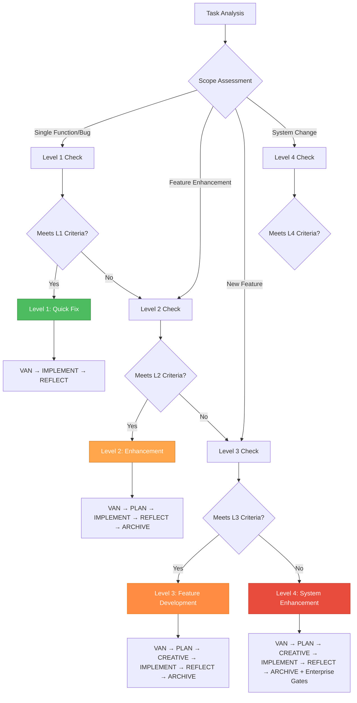

# Complexity Assessment System - Memory Bank v2.0

**Comprehensive task complexity evaluation framework with enterprise-grade quality requirements and architectural considerations.**

---

## 🎯 Complexity Level Determination Framework

### Level Assessment Matrix



---

## 📊 Level 1: Quick Fix (Bug Fixes & Hotfixes)

### Criteria
- **Scope**: Single function, method, or configuration change
- **Impact**: Localized to specific component or module
- **Risk**: Low risk of side effects or regression
- **Time**: Typically 1-4 hours of work
- **Testing**: Unit tests and basic integration tests sufficient

### Quality Requirements
```yaml
code_quality:
  coverage_minimum: 90%
  complexity_max: 5
  refactoring_required: false
  
testing_strategy:
  unit_tests: required
  integration_tests: basic
  e2e_tests: optional
  
documentation:
  inline_comments: minimal
  change_log: required
  architecture_impact: none
```

### Examples
- **Bug Fixes**: Null pointer exceptions, off-by-one errors, validation bugs
- **Configuration**: Environment variable updates, simple feature flags
- **UI Fixes**: CSS adjustments, text corrections, minor layout issues
- **Performance**: Simple query optimization, caching parameter tuning

### Quality Gates
1. **Pre-Implementation**: Identify root cause and minimal change scope
2. **Implementation**: Write failing test → Fix → Verify test passes
3. **Validation**: Run regression tests, check for side effects
4. **Documentation**: Update change log and inline comments

### Workflow Pattern
```
VAN (5 min) → IMPLEMENT (30-60 min) → REFLECT (10 min)
```

---

## 🔧 Level 2: Enhancement (Feature Extensions)

### Criteria
- **Scope**: Extending existing functionality or adding simple features
- **Impact**: May affect multiple related components
- **Risk**: Moderate risk requiring careful testing
- **Time**: Typically 4-16 hours of work
- **Testing**: Comprehensive unit and integration testing required

### Quality Requirements
```yaml
code_quality:
  coverage_minimum: 85%
  complexity_max: 8
  refactoring_opportunity: evaluate
  
testing_strategy:
  unit_tests: comprehensive
  integration_tests: required
  e2e_tests: key_scenarios
  
documentation:
  api_changes: required
  architecture_impact: minimal
  user_documentation: update
```

### Examples
- **Feature Extensions**: Adding fields to forms, new API endpoints, enhanced filtering
- **Integration**: Third-party service integration, new data sources
- **UI Enhancements**: New components, improved user workflows
- **Performance**: Database indexing, caching strategies, algorithm improvements

### Quality Gates
1. **Analysis**: Assess integration points and dependencies
2. **Planning**: Design extension strategy maintaining existing architecture
3. **Implementation**: TDD approach with comprehensive testing
4. **Validation**: Performance testing, compatibility verification
5. **Documentation**: API documentation, user guide updates

### Workflow Pattern
```
VAN (15 min) → PLAN (45 min) → IMPLEMENT (2-8 hours) → REFLECT (30 min) → ARCHIVE (15 min)
```

---

## 🏗️ Level 3: Feature Development (New Features)

### Criteria
- **Scope**: Complete new functionality requiring design decisions
- **Impact**: Multiple components, potential architecture changes
- **Risk**: High risk requiring extensive testing and review
- **Time**: Typically 16-80 hours of work
- **Testing**: Full test pyramid with comprehensive coverage

### Quality Requirements
```yaml
code_quality:
  coverage_minimum: 80%
  complexity_max: 10
  refactoring_required: true
  architecture_review: required
  
testing_strategy:
  unit_tests: comprehensive
  integration_tests: full_coverage
  e2e_tests: complete_scenarios
  performance_tests: required
  
documentation:
  architecture_decisions: required
  api_documentation: comprehensive
  user_documentation: complete
  deployment_guide: required
```

### Examples
- **New Features**: User authentication, payment processing, reporting systems
- **Module Development**: Complete new modules or services
- **Architecture**: New layers, patterns, or architectural components
- **Complex Integration**: Multi-system integration, data migration

### Quality Gates
1. **Analysis**: Comprehensive requirements and architectural impact assessment
2. **Planning**: Detailed implementation strategy with dependency analysis
3. **Design**: Architectural exploration with multiple options evaluation
4. **Implementation**: Phased development with continuous testing
5. **Validation**: Full test suite, performance benchmarking, security review
6. **Documentation**: Complete technical and user documentation

### Workflow Pattern
```
VAN (30 min) → PLAN (2 hours) → CREATIVE (3-6 hours) → IMPLEMENT (8-40 hours) → REFLECT (2 hours) → ARCHIVE (2 hours)
```

---

## 🏢 Level 4: System Enhancement (Major Changes)

### Criteria
- **Scope**: System-wide changes affecting multiple subsystems
- **Impact**: Significant architectural or infrastructure changes
- **Risk**: Very high risk requiring extensive validation
- **Time**: Typically 80+ hours of work
- **Testing**: Enterprise-grade testing with full validation

### Quality Requirements
```yaml
code_quality:
  coverage_minimum: 90%
  complexity_max: 8
  refactoring_required: extensive
  architecture_review: mandatory
  security_review: required
  
testing_strategy:
  unit_tests: comprehensive
  integration_tests: exhaustive
  e2e_tests: complete_coverage
  performance_tests: benchmarking
  security_tests: penetration
  load_tests: scalability
  
documentation:
  architecture_decisions: comprehensive
  api_documentation: complete
  user_documentation: full_suite
  deployment_guide: detailed
  runbooks: operational
  training_materials: required
```

### Examples
- **System Redesign**: Architecture migration, technology stack changes
- **Platform Upgrades**: Framework upgrades, infrastructure modernization
- **Enterprise Features**: Multi-tenancy, advanced security, compliance
- **Scalability**: Microservices migration, distributed systems implementation

### Quality Gates
1. **Enterprise Analysis**: Stakeholder alignment, business impact assessment
2. **Strategic Planning**: Comprehensive implementation roadmap
3. **Architectural Design**: Multiple architecture options with risk analysis
4. **Phased Implementation**: Incremental delivery with quality gates
5. **Enterprise Validation**: Full security audit, performance benchmarking
6. **Knowledge Transfer**: Complete documentation, training, handover

### Workflow Pattern
```
VAN (1-2 hours) → PLAN (4-8 hours) → CREATIVE (8-16 hours) → IMPLEMENT (40-200 hours) → REFLECT (4 hours) → ARCHIVE (4-8 hours)
```

---

## 🎯 Assessment Decision Tree

### Primary Assessment Questions

#### 1. Scope Analysis
```
Q: How many files/components will be modified?
- 1-2 files: Lean toward Level 1-2
- 3-10 files: Lean toward Level 2-3
- 10+ files: Lean toward Level 3-4
```

#### 2. Architectural Impact
```
Q: Will this change require architectural decisions?
- No architectural changes: Level 1-2
- Minor architectural considerations: Level 2-3
- Significant architectural impact: Level 3-4
```

#### 3. Risk Assessment
```
Q: What's the risk of breaking existing functionality?
- Very low risk: Level 1
- Low to moderate risk: Level 2
- High risk: Level 3
- System-wide risk: Level 4
```

#### 4. Testing Requirements
```
Q: What level of testing is required?
- Unit tests only: Level 1
- Unit + integration: Level 2
- Full test pyramid: Level 3
- Enterprise testing: Level 4
```

#### 5. Time Estimation
```
Q: Estimated implementation time?
- < 4 hours: Level 1
- 4-16 hours: Level 2
- 16-80 hours: Level 3
- 80+ hours: Level 4
```

### Secondary Assessment Factors

#### Business Impact
- **Level 1**: Internal fixes, no user impact
- **Level 2**: User experience improvements, minor features
- **Level 3**: Significant user value, competitive features
- **Level 4**: Strategic business initiatives, major capabilities

#### Technical Complexity
- **Level 1**: Straightforward implementation
- **Level 2**: Some complexity, established patterns
- **Level 3**: Complex logic, design decisions required
- **Level 4**: High complexity, research and innovation needed

#### Dependencies
- **Level 1**: No external dependencies
- **Level 2**: Few internal dependencies
- **Level 3**: Multiple internal/external dependencies
- **Level 4**: Complex dependency chains, coordination required

---

## 🔍 Quality Assessment Integration

### Code Quality Metrics by Level

#### Level 1: Quick Fix Standards
```yaml
metrics:
  cyclomatic_complexity: ≤ 5
  test_coverage: ≥ 90%
  code_duplication: ≤ 1%
  maintainability_index: ≥ 80

validation:
  - Verify fix addresses root cause
  - Ensure no regression introduction
  - Validate minimal change principle
```

#### Level 2: Enhancement Standards
```yaml
metrics:
  cyclomatic_complexity: ≤ 8
  test_coverage: ≥ 85%
  code_duplication: ≤ 2%
  maintainability_index: ≥ 75

validation:
  - Architecture consistency check
  - Integration point validation
  - Performance impact assessment
```

#### Level 3: Feature Development Standards
```yaml
metrics:
  cyclomatic_complexity: ≤ 10
  test_coverage: ≥ 80%
  code_duplication: ≤ 3%
  maintainability_index: ≥ 70

validation:
  - Design pattern compliance
  - Security requirement verification
  - Scalability consideration check
```

#### Level 4: System Enhancement Standards
```yaml
metrics:
  cyclomatic_complexity: ≤ 8
  test_coverage: ≥ 90%
  code_duplication: ≤ 2%
  maintainability_index: ≥ 80

validation:
  - Enterprise architecture compliance
  - Security audit completion
  - Performance benchmark achievement
  - Operational readiness verification
```

---

## 🚨 Level Escalation Triggers

### Automatic Escalation Conditions

#### From Level 1 to Level 2
- Implementation requires > 2 file changes
- Testing reveals integration complexities
- Performance impact exceeds expectations
- Architectural questions arise during implementation

#### From Level 2 to Level 3
- Scope creep requires design decisions
- Multiple architectural patterns considered
- Security implications discovered
- Cross-team coordination needed

#### From Level 3 to Level 4
- System-wide architectural changes required
- Enterprise compliance requirements triggered
- Multi-phase rollout strategy needed
- Significant infrastructure changes required

### De-escalation Opportunities

#### From Higher to Lower Level
- Scope reduction through requirements refinement
- Technical solution simplification
- Risk mitigation through alternative approaches
- Complexity reduction through refactoring

---

## 📋 Assessment Checklist Template

### Quick Assessment (2-minute evaluation)
```
□ Task scope clearly defined
□ Impact area identified (1-2-3-many components)
□ Risk level assessed (low-medium-high-critical)
□ Time estimate provided (hours)
□ Testing requirements identified
□ Architecture impact evaluated
□ Quality standards determined
```

### Detailed Assessment (15-minute evaluation)
```
□ Stakeholder requirements documented
□ Technical constraints identified
□ Dependency analysis completed
□ Risk mitigation strategies defined
□ Quality gate criteria established
□ Success metrics defined
□ Rollback plan considered
□ Documentation requirements specified
```

---

## 🎯 Integration with Development Workflow

### VAN Mode Complexity Assessment

When VAN mode analyzes a task, it follows this assessment process:

1. **Initial Scope Analysis**: Rapid categorization based on description
2. **Codebase Impact Assessment**: Analysis of files and components affected
3. **Risk Evaluation**: Assessment of potential breaking changes
4. **Quality Requirements Definition**: Standards and gates for the level
5. **Workflow Path Determination**: Optimal mode sequence for complexity
6. **Resource Planning**: Time and skill requirements estimation

### Quality Gate Integration

Each complexity level integrates specific quality gates:

- **Level 1**: Focus on regression prevention and minimal change validation
- **Level 2**: Emphasis on integration testing and compatibility
- **Level 3**: Comprehensive quality pyramid with design validation
- **Level 4**: Enterprise-grade validation with security and performance audits

### Continuous Reassessment

The system provides mechanisms for complexity reassessment:

- **Mid-implementation escalation**: When scope or complexity increases
- **Quality gate failures**: When quality standards indicate higher complexity
- **Risk discovery**: When new risks or dependencies are identified
- **Stakeholder feedback**: When requirements change or expand

---

**This assessment framework ensures appropriate quality standards, testing strategies, and workflow paths are applied based on task complexity, leading to better outcomes and reduced technical debt.**