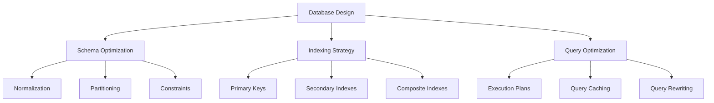

# Database Optimization Guidelines - Memory Bank v2.0

**Comprehensive database performance optimization framework with language-agnostic principles for scalable data management.**

---

## 🗄️ Database Design Principles

### Core Design Philosophy
- **Normalization First**: Start with normalized design, denormalize strategically
- **Performance by Design**: Consider query patterns during schema design
- **Scalability Planning**: Design for horizontal and vertical scaling
- **Data Integrity**: Maintain ACID properties with proper constraints
- **Security by Default**: Implement secure access patterns and encryption

### Universal Database Patterns


---

## 📊 Schema Design Optimization

### Normalization Guidelines
```sql
-- Language-agnostic schema principles

-- 1NF: Atomic values, unique column names
CREATE TABLE users (
    id INTEGER PRIMARY KEY,
    email VARCHAR(255) UNIQUE NOT NULL,
    first_name VARCHAR(100) NOT NULL,
    last_name VARCHAR(100) NOT NULL,
    created_at TIMESTAMP DEFAULT CURRENT_TIMESTAMP
);

-- 2NF: No partial dependencies
CREATE TABLE orders (
    id INTEGER PRIMARY KEY,
    user_id INTEGER REFERENCES users(id),
    order_date TIMESTAMP DEFAULT CURRENT_TIMESTAMP,
    total_amount DECIMAL(10,2) NOT NULL
);

CREATE TABLE order_items (
    id INTEGER PRIMARY KEY,
    order_id INTEGER REFERENCES orders(id),
    product_id INTEGER REFERENCES products(id),
    quantity INTEGER NOT NULL,
    unit_price DECIMAL(10,2) NOT NULL
);

-- 3NF: No transitive dependencies
-- total_amount in orders is calculated, not stored redundantly
```

### Strategic Denormalization
```sql
-- When to denormalize for performance
CREATE TABLE order_summary (
    order_id INTEGER PRIMARY KEY REFERENCES orders(id),
    user_email VARCHAR(255), -- Denormalized for faster queries
    item_count INTEGER,      -- Calculated field
    total_amount DECIMAL(10,2), -- Calculated field
    created_at TIMESTAMP,
    -- Maintained via triggers or application logic
    updated_at TIMESTAMP DEFAULT CURRENT_TIMESTAMP
);

-- Use materialized views where supported
CREATE MATERIALIZED VIEW user_order_stats AS
SELECT 
    u.id,
    u.email,
    COUNT(o.id) as order_count,
    SUM(o.total_amount) as total_spent,
    MAX(o.order_date) as last_order_date
FROM users u
LEFT JOIN orders o ON u.id = o.user_id
GROUP BY u.id, u.email;
```

---

## 🔍 Indexing Strategies

### Index Types and Usage
```sql
-- Primary key index (automatic)
CREATE TABLE products (
    id INTEGER PRIMARY KEY,
    name VARCHAR(255) NOT NULL,
    category_id INTEGER,
    price DECIMAL(10,2),
    created_at TIMESTAMP
);

-- Single column indexes
CREATE INDEX idx_products_category ON products(category_id);
CREATE INDEX idx_products_price ON products(price);

-- Composite indexes (order matters!)
CREATE INDEX idx_products_category_price ON products(category_id, price);
CREATE INDEX idx_products_created_category ON products(created_at, category_id);

-- Partial indexes for filtered queries
CREATE INDEX idx_active_products ON products(category_id) 
WHERE active = true;

-- Functional indexes
CREATE INDEX idx_users_email_lower ON users(LOWER(email));
```

### Index Selection Guidelines
```yaml
indexing_strategy:
  primary_keys:
    - always_indexed: true
    - use_sequential: "For better insert performance"
    - consider_uuid: "For distributed systems"
  
  foreign_keys:
    - always_index: "For join performance"
    - consider_composite: "When querying with additional filters"
  
  query_patterns:
    - where_clauses: "Index columns used in WHERE"
    - order_by: "Index columns used in ORDER BY"
    - group_by: "Consider covering indexes"
  
  maintenance:
    - monitor_usage: "Remove unused indexes"
    - update_statistics: "Keep statistics current"
    - rebuild_fragmented: "When fragmentation > 30%"
```

---

## ⚡ Query Optimization

### Query Writing Best Practices
```sql
-- Efficient query patterns

-- 1. Use specific columns instead of SELECT *
SELECT id, name, email FROM users WHERE active = true;

-- 2. Use EXISTS instead of IN for subqueries
SELECT * FROM orders o
WHERE EXISTS (
    SELECT 1 FROM order_items oi 
    WHERE oi.order_id = o.id AND oi.quantity > 10
);

-- 3. Use appropriate JOIN types
SELECT u.name, COUNT(o.id) as order_count
FROM users u
LEFT JOIN orders o ON u.id = o.user_id
WHERE u.active = true
GROUP BY u.id, u.name;

-- 4. Use LIMIT for pagination
SELECT * FROM products 
ORDER BY created_at DESC 
LIMIT 20 OFFSET 40;

-- 5. Use prepared statements to prevent SQL injection
-- and enable query plan caching
PREPARE user_orders (INTEGER) AS
    SELECT * FROM orders WHERE user_id = $1;
```

### Query Optimization Patterns
```sql
-- Avoid functions in WHERE clauses
-- Bad:
SELECT * FROM orders WHERE YEAR(created_at) = 2024;

-- Good:
SELECT * FROM orders 
WHERE created_at >= '2024-01-01' 
  AND created_at < '2025-01-01';

-- Use covering indexes
CREATE INDEX idx_order_covering 
ON orders(user_id, created_at) 
INCLUDE (total_amount, status);

-- This query can be satisfied entirely from the index
SELECT total_amount, status 
FROM orders 
WHERE user_id = 123 
ORDER BY created_at DESC;
```

---

## 🚀 Performance Optimization Techniques

### Connection Management
```yaml
connection_pooling:
  pool_size:
    web_apps: "10-20 connections per application instance"
    background_jobs: "5-10 connections per worker"
    reporting: "2-5 dedicated connections"
  
  configuration:
    max_lifetime: "30 minutes"
    idle_timeout: "10 minutes"
    validation_query: "SELECT 1"
    
  monitoring:
    active_connections: "Monitor usage patterns"
    wait_time: "Should be < 100ms"
    pool_exhaustion: "Alert on exhaustion events"
```

### Caching Strategies
```typescript
// Language-agnostic caching patterns
interface CachingStrategy {
  // Query result caching
  queryCache: {
    ttl: number; // Time to live in seconds
    invalidation: 'time' | 'event' | 'manual';
    storage: 'memory' | 'redis' | 'database';
  };
  
  // Application-level caching
  applicationCache: {
    layer: 'orm' | 'service' | 'controller';
    scope: 'session' | 'user' | 'global';
    strategy: 'write-through' | 'write-behind' | 'read-through';
  };
  
  // Database-level caching
  databaseCache: {
    queryPlan: boolean;
    resultSet: boolean;
    bufferPool: string; // Size configuration
  };
}

// Implementation example (Node.js/TypeScript)
class DatabaseCache {
  private cache = new Map<string, CacheItem>();
  
  async query(sql: string, params: any[]): Promise<any[]> {
    const cacheKey = this.generateKey(sql, params);
    
    // Check cache first
    const cached = this.cache.get(cacheKey);
    if (cached && !this.isExpired(cached)) {
      return cached.data;
    }
    
    // Execute query
    const result = await this.database.query(sql, params);
    
    // Cache result
    this.cache.set(cacheKey, {
      data: result,
      timestamp: Date.now(),
      ttl: this.getTTL(sql)
    });
    
    return result;
  }
}
```

---

## 📈 Monitoring and Metrics

### Performance Metrics
```yaml
database_metrics:
  response_time:
    target: "< 100ms for simple queries"
    warning: "> 500ms"
    critical: "> 2000ms"
  
  throughput:
    reads_per_second: "Monitor peak and average"
    writes_per_second: "Monitor with read/write ratio"
    connections_per_second: "Track connection churn"
  
  resource_utilization:
    cpu: "< 70% average, < 90% peak"
    memory: "< 80% of available"
    disk_io: "Monitor for bottlenecks"
    network: "Track bandwidth usage"
  
  query_analysis:
    slow_queries: "Log queries > 1 second"
    missing_indexes: "Identify optimization opportunities"
    lock_waits: "Monitor for contention"
```

### Monitoring Implementation
```sql
-- Enable query logging for analysis
-- PostgreSQL
SET log_min_duration_statement = 1000; -- Log queries > 1 second

-- MySQL
SET global slow_query_log = 'ON';
SET global long_query_time = 1;

-- SQL Server
-- Use Extended Events for query monitoring

-- Create monitoring views
CREATE VIEW slow_queries AS
SELECT 
    query,
    avg_execution_time,
    call_count,
    total_execution_time
FROM performance_schema.query_statistics
WHERE avg_execution_time > 1000000; -- > 1 second in microseconds
```

---

## 🔄 Database Scaling Strategies

### Vertical Scaling (Scale Up)
```yaml
vertical_scaling:
  cpu: "Add more cores for CPU-bound workloads"
  memory: "Increase RAM for better caching"
  storage: "Use SSDs for I/O-bound workloads"
  
  optimization_order:
    1. "Optimize queries and indexes"
    2. "Increase memory for buffer pools"
    3. "Upgrade to faster storage (SSD/NVMe)"
    4. "Add CPU cores for parallel processing"
```

### Horizontal Scaling (Scale Out)
```yaml
horizontal_scaling:
  read_replicas:
    use_cases: "Read-heavy workloads"
    implementation: "Master-slave replication"
    routing: "Application-level or proxy-based"
  
  sharding:
    strategies:
      - range: "Partition by ID ranges"
      - hash: "Partition by hash function"
      - directory: "Use lookup service"
      - geographic: "Partition by location"
    
    considerations:
      - cross_shard_queries: "Minimize or aggregate"
      - rebalancing: "Plan for shard redistribution"
      - transactions: "Handle distributed transactions"
  
  federation:
    approach: "Split databases by feature/service"
    benefits: "Independent scaling and deployment"
    challenges: "Cross-database transactions"
```

### Partitioning Strategies
```sql
-- Range partitioning (PostgreSQL example)
CREATE TABLE orders_2024 PARTITION OF orders
FOR VALUES FROM ('2024-01-01') TO ('2025-01-01');

-- Hash partitioning
CREATE TABLE orders_hash_0 PARTITION OF orders
FOR VALUES WITH (MODULUS 4, REMAINDER 0);

-- List partitioning
CREATE TABLE orders_us PARTITION OF orders
FOR VALUES IN ('US', 'CA');

-- Composite partitioning
CREATE TABLE sales (
    sale_date DATE,
    region VARCHAR(10),
    amount DECIMAL(10,2)
) PARTITION BY RANGE (sale_date);

CREATE TABLE sales_2024 PARTITION OF sales
FOR VALUES FROM ('2024-01-01') TO ('2025-01-01')
PARTITION BY LIST (region);
```

---

## 🛡️ Security and Data Protection

### Access Control
```sql
-- Principle of least privilege
CREATE ROLE app_reader;
GRANT SELECT ON users, products, orders TO app_reader;

CREATE ROLE app_writer;
GRANT SELECT, INSERT, UPDATE ON users, orders, order_items TO app_writer;
GRANT DELETE ON order_items TO app_writer; -- Specific permissions only

-- Row-level security (PostgreSQL)
CREATE POLICY user_data_policy ON orders
FOR ALL TO app_user
USING (user_id = current_setting('app.user_id')::INTEGER);

ALTER TABLE orders ENABLE ROW LEVEL SECURITY;
```

### Data Encryption
```yaml
encryption_strategy:
  at_rest:
    database_level: "Transparent Data Encryption (TDE)"
    column_level: "For sensitive data (PII, payments)"
    backup_encryption: "Encrypted backups"
  
  in_transit:
    ssl_tls: "Encrypt client-database connections"
    certificate_validation: "Verify server certificates"
    perfect_forward_secrecy: "Use ephemeral key exchange"
  
  key_management:
    rotation: "Regular key rotation schedule"
    storage: "Secure key management system"
    access_control: "Limit key access"
```

---

## 🔧 Database-Specific Optimizations

### PostgreSQL Optimizations
```sql
-- Configuration tuning
-- postgresql.conf
shared_buffers = '25% of RAM'
effective_cache_size = '75% of RAM'
work_mem = '4MB'
maintenance_work_mem = '64MB'
checkpoint_segments = 32
checkpoint_completion_target = 0.9

-- Use EXPLAIN ANALYZE for query planning
EXPLAIN (ANALYZE, BUFFERS) 
SELECT * FROM orders o
JOIN users u ON o.user_id = u.id
WHERE o.created_at > NOW() - INTERVAL '30 days';

-- Vacuum and analyze regularly
VACUUM ANALYZE users;
-- Or use pg_cron for automation
SELECT cron.schedule('vacuum-job', '0 2 * * *', 'VACUUM ANALYZE;');
```

### MySQL Optimizations
```sql
-- Configuration tuning (my.cnf)
-- innodb_buffer_pool_size = 70% of RAM
-- innodb_log_file_size = 256MB
-- innodb_flush_log_at_trx_commit = 2
-- query_cache_size = 64MB

-- Use query cache effectively
SELECT SQL_CACHE * FROM products WHERE category_id = 1;

-- Optimize with MySQL-specific features
-- Use covering indexes
ALTER TABLE orders ADD INDEX idx_covering (user_id, created_at, total_amount);

-- Use partitioning
ALTER TABLE logs PARTITION BY RANGE (YEAR(created_at)) (
    PARTITION p2023 VALUES LESS THAN (2024),
    PARTITION p2024 VALUES LESS THAN (2025)
);
```

### SQL Server Optimizations
```sql
-- Index optimization
-- Use SQL Server-specific features
CREATE COLUMNSTORE INDEX ix_orders_columnstore 
ON orders (user_id, created_at, total_amount);

-- Use query hints when necessary
SELECT * FROM orders WITH (INDEX(ix_orders_user_date))
WHERE user_id = 123;

-- Memory-optimized tables for high-performance scenarios
CREATE TABLE hot_data (
    id INT NOT NULL PRIMARY KEY NONCLUSTERED HASH WITH (BUCKET_COUNT = 1000000),
    data NVARCHAR(100)
) WITH (MEMORY_OPTIMIZED = ON, DURABILITY = SCHEMA_AND_DATA);
```

### NoSQL Optimizations
```javascript
// MongoDB optimization patterns
// Use compound indexes effectively
db.orders.createIndex({
  "user_id": 1,
  "created_at": -1,
  "status": 1
});

// Use aggregation pipeline for complex queries
db.orders.aggregate([
  { $match: { created_at: { $gte: new Date("2024-01-01") } } },
  { $group: { 
      _id: "$user_id", 
      total: { $sum: "$amount" },
      count: { $sum: 1 }
  }},
  { $sort: { total: -1 } },
  { $limit: 100 }
]);

// Redis optimization patterns
// Use appropriate data structures
HSET user:123 name "John Doe" email "john@example.com"
ZADD leaderboard 1500 user:123
LPUSH notifications:123 "New message"

// Use pipelining for multiple operations
const pipeline = redis.pipeline();
pipeline.hget('user:123', 'name');
pipeline.zscore('leaderboard', 'user:123');
const results = await pipeline.exec();
```

---

## 📋 Database Performance Checklist

### Pre-deployment Database Audit
```yaml
schema_design:
  - [ ] Appropriate normalization level
  - [ ] Primary keys on all tables
  - [ ] Foreign key constraints defined
  - [ ] Data types optimized for storage
  - [ ] Nullable columns minimized

indexing:
  - [ ] Primary key indexes present
  - [ ] Foreign key columns indexed
  - [ ] Query-specific indexes created
  - [ ] Composite index order optimized
  - [ ] Unused indexes removed

queries:
  - [ ] Query execution plans analyzed
  - [ ] Slow queries identified and optimized
  - [ ] Appropriate JOIN types used
  - [ ] LIMIT used for large result sets
  - [ ] Prepared statements implemented

performance:
  - [ ] Connection pooling configured
  - [ ] Query caching enabled
  - [ ] Database statistics updated
  - [ ] Monitoring and alerting setup
  - [ ] Backup and recovery tested

security:
  - [ ] Access controls implemented
  - [ ] SQL injection prevention
  - [ ] Data encryption configured
  - [ ] Audit logging enabled
  - [ ] Regular security updates applied
```

---

## 🔍 Troubleshooting Common Issues

### Performance Problems
```sql
-- Identify slow queries
-- PostgreSQL
SELECT query, mean_time, calls, total_time
FROM pg_stat_statements
ORDER BY mean_time DESC
LIMIT 10;

-- MySQL
SELECT 
    sql_text,
    avg_timer_wait/1000000000 as avg_time_seconds,
    count_star as execution_count
FROM performance_schema.events_statements_summary_by_digest
ORDER BY avg_timer_wait DESC
LIMIT 10;

-- Check for missing indexes
-- PostgreSQL
SELECT schemaname, tablename, attname, n_distinct, correlation
FROM pg_stats
WHERE schemaname = 'public'
  AND n_distinct > 100
  AND correlation < 0.1;
```

### Lock Contention
```sql
-- Monitor locks (PostgreSQL)
SELECT 
    blocked_locks.pid AS blocked_pid,
    blocked_activity.usename AS blocked_user,
    blocking_locks.pid AS blocking_pid,
    blocking_activity.usename AS blocking_user,
    blocked_activity.query AS blocked_statement,
    blocking_activity.query AS current_statement_in_blocking_process
FROM pg_catalog.pg_locks blocked_locks
JOIN pg_catalog.pg_stat_activity blocked_activity 
    ON blocked_activity.pid = blocked_locks.pid
JOIN pg_catalog.pg_locks blocking_locks 
    ON blocking_locks.locktype = blocked_locks.locktype
    AND blocking_locks.database IS NOT DISTINCT FROM blocked_locks.database
    AND blocking_locks.relation IS NOT DISTINCT FROM blocked_locks.relation
JOIN pg_catalog.pg_stat_activity blocking_activity 
    ON blocking_activity.pid = blocking_locks.pid
WHERE NOT blocked_locks.granted;
```

---

**These database optimization guidelines ensure high-performance, scalable, and secure data management across all database platforms while maintaining language-agnostic principles for maximum applicability.**