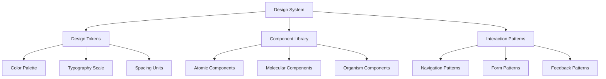

# UI/UX Optimization Guidelines - Memory Bank v2.0

**Comprehensive user experience optimization framework with language-agnostic principles for modern application development.**

---

## 🎨 UI/UX Design Principles

### Core UX Principles
- **User-Centered Design**: Always prioritize user needs and workflows
- **Accessibility First**: Design for all users, including those with disabilities
- **Consistency**: Maintain consistent patterns across the entire application
- **Performance**: Optimize for fast loading and smooth interactions
- **Mobile-First**: Design responsive interfaces that work on all devices

### Design System Integration


---

## 🔧 Implementation Guidelines by Technology

### Frontend Framework Agnostic Principles

#### Component Architecture
```typescript
// Language-agnostic component structure
interface ComponentProps {
  // Accessibility
  ariaLabel?: string;
  ariaDescribedBy?: string;
  role?: string;
  
  // Visual
  variant?: 'primary' | 'secondary' | 'tertiary';
  size?: 'small' | 'medium' | 'large';
  
  // Interaction
  disabled?: boolean;
  loading?: boolean;
  onClick?: () => void;
  
  // Content
  children?: ReactNode | VueNode | AngularContent;
}
```

#### Performance Optimization
```yaml
performance_standards:
  first_contentful_paint: < 1.5s
  largest_contentful_paint: < 2.5s
  cumulative_layout_shift: < 0.1
  first_input_delay: < 100ms
  
optimization_techniques:
  - lazy_loading: "Load content on demand"
  - code_splitting: "Split bundles by routes/features"
  - image_optimization: "WebP, AVIF, responsive images"
  - caching_strategy: "Aggressive caching with smart invalidation"
```

---

## 📱 Responsive Design Standards

### Breakpoint System
```scss
// Language-agnostic breakpoint definitions
$breakpoints: (
  'mobile': 320px,
  'tablet': 768px,
  'desktop': 1024px,
  'wide': 1440px
);

// Spacing scale based on 8px grid
$spacing: (
  'xs': 4px,   // 0.5 units
  'sm': 8px,   // 1 unit
  'md': 16px,  // 2 units
  'lg': 24px,  // 3 units
  'xl': 32px,  // 4 units
  'xxl': 48px  // 6 units
);
```

### Mobile-First Implementation
```css
/* Base styles (mobile) */
.component {
  padding: var(--spacing-sm);
  font-size: var(--text-sm);
}

/* Tablet and up */
@media (min-width: 768px) {
  .component {
    padding: var(--spacing-md);
    font-size: var(--text-base);
  }
}

/* Desktop and up */
@media (min-width: 1024px) {
  .component {
    padding: var(--spacing-lg);
    font-size: var(--text-lg);
  }
}
```

---

## ♿ Accessibility (A11y) Requirements

### WCAG 2.1 AA Compliance
```yaml
accessibility_standards:
  color_contrast: 
    normal_text: 4.5:1
    large_text: 3:1
    non_text: 3:1
  
  keyboard_navigation:
    focus_indicators: visible
    tab_order: logical
    skip_links: provided
  
  screen_reader:
    alt_text: descriptive
    aria_labels: meaningful
    semantic_markup: proper
  
  content:
    language_declared: required
    headings_hierarchical: enforced
    error_messages: clear
```

### Implementation Checklist
```html
<!-- Semantic HTML -->
<main role="main">
  <h1>Page Title</h1>
  <section aria-labelledby="section-heading">
    <h2 id="section-heading">Section Title</h2>
    <form aria-label="User registration">
      <label for="email">Email Address</label>
      <input 
        id="email" 
        type="email" 
        required 
        aria-describedby="email-error"
        aria-invalid="false"
      />
      <div id="email-error" role="alert"></div>
    </form>
  </section>
</main>
```

---

## 🚀 Performance Optimization

### Loading Strategies
```typescript
// Language-agnostic loading patterns
interface LoadingStrategy {
  // Critical path
  critical: 'inline' | 'preload';
  
  // Above the fold
  aboveFold: 'eager' | 'high-priority';
  
  // Below the fold
  belowFold: 'lazy' | 'intersection-observer';
  
  // Route-based
  routes: 'code-split' | 'prefetch';
}

// Implementation example
const optimizedComponent = {
  // Critical CSS inlined
  criticalCSS: true,
  
  // Lazy load non-critical components
  lazyLoad: ['Modal', 'Carousel', 'Chart'],
  
  // Prefetch next likely routes
  prefetch: ['/dashboard', '/profile'],
  
  // Image optimization
  images: {
    format: ['webp', 'avif', 'fallback'],
    responsive: true,
    lazy: true
  }
};
```

### Code Splitting Strategies
```javascript
// Route-based splitting
const routes = [
  {
    path: '/dashboard',
    component: () => import('./Dashboard.vue'), // Vue
    // component: lazy(() => import('./Dashboard')), // React
    // loadChildren: () => import('./dashboard/dashboard.module'), // Angular
  }
];

// Feature-based splitting
const features = {
  charts: () => import('./charts'),
  reports: () => import('./reports'),
  admin: () => import('./admin')
};
```

---

## 🎯 User Experience Patterns

### Interaction Patterns
```yaml
interaction_patterns:
  feedback:
    immediate: "Visual feedback within 100ms"
    progress: "Progress indicators for >2s operations"
    completion: "Clear success/error states"
  
  navigation:
    breadcrumbs: "For deep hierarchies"
    search: "For content-heavy applications"
    filters: "For data-heavy interfaces"
  
  forms:
    validation: "Real-time with clear messaging"
    progressive: "Break complex forms into steps"
    autosave: "Prevent data loss"
  
  error_handling:
    prevention: "Validate before submission"
    recovery: "Clear instructions for fixes"
    graceful: "Fallbacks for failed operations"
```

### Micro-interactions
```typescript
// Animation principles (language-agnostic)
interface Animation {
  duration: 200 | 300 | 500; // ms
  easing: 'ease-out' | 'ease-in-out' | 'spring';
  purpose: 'feedback' | 'transition' | 'attention';
}

const animations = {
  // Button feedback
  buttonPress: {
    duration: 150,
    easing: 'ease-out',
    transform: 'scale(0.95)'
  },
  
  // Page transitions
  pageTransition: {
    duration: 300,
    easing: 'ease-in-out',
    opacity: [0, 1]
  },
  
  // Error attention
  errorShake: {
    duration: 500,
    easing: 'ease-out',
    transform: 'translateX([-10px, 10px, -5px, 5px, 0])'
  }
};
```

---

## 🧪 UX Testing and Validation

### Usability Testing Framework
```yaml
testing_methods:
  automated:
    lighthouse: "Performance and accessibility audits"
    axe: "Accessibility testing"
    cypress: "E2E user journey testing"
  
  manual:
    user_testing: "5-8 users per iteration"
    accessibility_testing: "Screen reader and keyboard testing"
    performance_testing: "Real device testing"
  
  analytics:
    user_behavior: "Heat maps and session recordings"
    performance: "Core Web Vitals monitoring"
    accessibility: "A11y compliance monitoring"
```

### UX Metrics
```typescript
interface UXMetrics {
  // Performance
  coreWebVitals: {
    lcp: number; // Largest Contentful Paint
    fid: number; // First Input Delay
    cls: number; // Cumulative Layout Shift
  };
  
  // User Behavior
  engagement: {
    timeOnPage: number;
    bounceRate: number;
    conversionRate: number;
  };
  
  // Accessibility
  accessibility: {
    wcagLevel: 'A' | 'AA' | 'AAA';
    keyboardNavigation: boolean;
    screenReaderCompatibility: boolean;
  };
}
```

---

## 🌐 Internationalization (i18n) & Localization

### Language-Agnostic i18n Patterns
```typescript
// Universal i18n interface
interface i18nConfig {
  // Language support
  defaultLocale: string;
  supportedLocales: string[];
  
  // Text direction
  rtlSupport: boolean;
  
  // Number formatting
  numberFormat: {
    currency: string;
    decimal: string;
    thousands: string;
  };
  
  // Date formatting
  dateFormat: {
    short: string;
    long: string;
    relative: boolean;
  };
}

// Implementation pattern
const i18n = {
  t: (key: string, params?: object) => string,
  formatNumber: (num: number, options?: object) => string,
  formatDate: (date: Date, format?: string) => string,
  formatCurrency: (amount: number, currency?: string) => string
};
```

### Cultural Adaptation
```yaml
localization_considerations:
  visual:
    - color_meanings: "Colors have different cultural meanings"
    - imagery: "Use culturally appropriate images"
    - layout: "Consider RTL layouts for Arabic, Hebrew"
  
  content:
    - text_expansion: "Account for 30-50% text growth"
    - tone: "Adapt tone for cultural context"
    - examples: "Use culturally relevant examples"
  
  functionality:
    - date_formats: "MM/DD/YYYY vs DD/MM/YYYY"
    - address_formats: "Country-specific address patterns"
    - payment_methods: "Regional payment preferences"
```

---

## 📊 Data Visualization Best Practices

### Chart and Graph Guidelines
```typescript
interface DataVisualization {
  // Color accessibility
  colorPalette: {
    colorBlindFriendly: boolean;
    contrast: 'high' | 'medium';
    patterns: boolean; // Alternative to color-only encoding
  };
  
  // Interaction
  interaction: {
    hover: 'tooltip' | 'highlight';
    zoom: boolean;
    filter: boolean;
    export: ['png', 'svg', 'csv'];
  };
  
  // Responsiveness
  responsive: {
    mobile: 'simplified' | 'horizontal-scroll';
    tablet: 'optimized';
    desktop: 'full-featured';
  };
}
```

### Implementation Example
```javascript
// Language-agnostic chart configuration
const chartConfig = {
  // Accessibility
  alt: "Monthly sales data showing 15% growth",
  aria: {
    label: "Interactive sales chart",
    describedBy: "chart-description"
  },
  
  // Responsive behavior
  responsive: {
    breakpoints: [768, 1024],
    behaviors: ['stack', 'scroll', 'full']
  },
  
  // Performance
  virtualization: true,
  lazyLoad: true,
  maxDataPoints: 1000
};
```

---

## 🔄 Design System Integration

### Component Design Principles
```typescript
// Universal component interface
interface DesignSystemComponent {
  // Visual consistency
  tokens: {
    colors: DesignTokens['colors'];
    typography: DesignTokens['typography'];
    spacing: DesignTokens['spacing'];
  };
  
  // Behavioral consistency
  patterns: {
    interaction: InteractionPattern;
    navigation: NavigationPattern;
    feedback: FeedbackPattern;
  };
  
  // Quality gates
  quality: {
    accessibility: 'AA' | 'AAA';
    performance: number; // Lighthouse score
    coverage: number; // Test coverage %
  };
}
```

### Design Token System
```json
{
  "colors": {
    "primary": {
      "50": "#f0f9ff",
      "500": "#3b82f6",
      "900": "#1e3a8a"
    },
    "semantic": {
      "success": "#10b981",
      "warning": "#f59e0b",
      "error": "#ef4444",
      "info": "#3b82f6"
    }
  },
  "typography": {
    "scale": {
      "xs": "0.75rem",
      "sm": "0.875rem",
      "base": "1rem",
      "lg": "1.125rem",
      "xl": "1.25rem"
    },
    "weight": {
      "normal": 400,
      "medium": 500,
      "semibold": 600,
      "bold": 700
    }
  },
  "spacing": {
    "scale": [0, 4, 8, 12, 16, 20, 24, 32, 40, 48, 64]
  }
}
```

---

## 🚨 Common UX Anti-patterns to Avoid

### Performance Anti-patterns
```yaml
avoid:
  performance:
    - large_bundle_sizes: "Split code and lazy load"
    - blocking_resources: "Use async/defer for scripts"
    - unoptimized_images: "Use modern formats and compression"
    - excessive_rerendering: "Optimize component updates"
  
  accessibility:
    - missing_alt_text: "Provide descriptive alt text"
    - poor_color_contrast: "Ensure 4.5:1 contrast ratio"
    - keyboard_traps: "Allow keyboard escape routes"
    - auto_playing_media: "Provide controls and preferences"
  
  usability:
    - unclear_navigation: "Provide clear navigation hierarchy"
    - inconsistent_patterns: "Maintain design system consistency"
    - poor_error_messages: "Provide actionable error guidance"
    - forced_registration: "Allow guest interactions where possible"
```

---

## 📋 UX Quality Checklist

### Pre-deployment UX Audit
```yaml
performance:
  - [ ] Lighthouse score > 90
  - [ ] Core Web Vitals within thresholds
  - [ ] Images optimized and responsive
  - [ ] Critical CSS inlined
  - [ ] JavaScript code-split

accessibility:
  - [ ] WCAG 2.1 AA compliance
  - [ ] Keyboard navigation functional
  - [ ] Screen reader compatible
  - [ ] Color contrast verified
  - [ ] Focus indicators visible

usability:
  - [ ] Mobile-first responsive design
  - [ ] Consistent interaction patterns
  - [ ] Clear error messages
  - [ ] Loading states implemented
  - [ ] Success feedback provided

internationalization:
  - [ ] Text externalized for translation
  - [ ] RTL layout support if needed
  - [ ] Cultural considerations addressed
  - [ ] Number/date formatting localized
```

---

## ⚡ Asynchronous Processing & UX Optimization

### Async UX Principles
- **Immediate Feedback**: Provide instant visual feedback for user actions
- **Progressive Loading**: Load content incrementally to maintain perceived performance
- **Graceful Degradation**: Handle failures elegantly with meaningful error states
- **State Management**: Maintain consistent UI state during async operations
- **User Control**: Allow users to cancel or retry long-running operations

### Loading States & Feedback Patterns

#### Loading State Hierarchy
```typescript
// Universal loading state interface
interface LoadingState {
  status: 'idle' | 'loading' | 'success' | 'error';
  progress?: number; // 0-100 for progress indicators
  message?: string;  // User-friendly status message
  cancellable?: boolean;
  retryable?: boolean;
}

// Implementation patterns
const asyncStates = {
  // Immediate feedback (< 100ms)
  immediate: {
    visual: 'button press animation',
    duration: '50-100ms',
    purpose: 'acknowledge user action'
  },
  
  // Short operations (100ms - 1s)
  short: {
    visual: 'spinner or progress indicator',
    duration: '100ms-1s',
    purpose: 'indicate processing'
  },
  
  // Medium operations (1s - 10s)
  medium: {
    visual: 'progress bar with percentage',
    duration: '1s-10s',
    purpose: 'show progress and estimated completion'
  },
  
  // Long operations (> 10s)
  long: {
    visual: 'detailed progress with steps',
    duration: '> 10s',
    purpose: 'provide transparency and control options'
  }
};
```

#### Progressive Loading Strategies
```typescript
// Language-agnostic progressive loading patterns
interface ProgressiveLoadingStrategy {
  // Critical path first
  critical: {
    content: 'above-the-fold content';
    priority: 'highest';
    loading: 'eager';
  };
  
  // Important content second
  important: {
    content: 'visible on scroll';
    priority: 'high';
    loading: 'intersection-observer';
  };
  
  // Optional content last
  optional: {
    content: 'non-essential features';
    priority: 'low';
    loading: 'user-initiated';
  };
}

// Skeleton loading implementation
const skeletonLoading = {
  // Show content structure while loading
  structure: 'maintain layout to prevent CLS',
  animation: 'subtle shimmer effect',
  duration: 'match expected load time',
  fallback: 'graceful timeout after 10s'
};
```

### Error Handling & Recovery Patterns

#### Error State Management
```typescript
interface ErrorState {
  type: 'network' | 'validation' | 'permission' | 'server' | 'unknown';
  message: string;
  recoverable: boolean;
  retryable: boolean;
  supportContact?: string;
}

// Error handling strategies
const errorHandling = {
  // Network errors
  network: {
    detection: 'offline detection, timeout handling',
    feedback: 'clear offline indicators',
    recovery: 'auto-retry with exponential backoff',
    fallback: 'cached content when available'
  },
  
  // Validation errors
  validation: {
    prevention: 'real-time validation',
    feedback: 'inline error messages',
    recovery: 'clear correction guidance',
    accessibility: 'aria-invalid and aria-describedby'
  },
  
  // Server errors
  server: {
    detection: 'HTTP status code handling',
    feedback: 'user-friendly error messages',
    recovery: 'retry mechanisms with limits',
    escalation: 'support contact information'
  }
};
```

#### Retry and Recovery Mechanisms
```typescript
// Universal retry strategy
class RetryManager {
  private attempts = 0;
  private maxAttempts = 3;
  private baseDelay = 1000; // 1 second
  
  async executeWithRetry<T>(
    operation: () => Promise<T>,
    options?: {
      maxAttempts?: number;
      baseDelay?: number;
      backoffFactor?: number;
      onRetry?: (attempt: number, error: Error) => void;
    }
  ): Promise<T> {
    const { 
      maxAttempts = this.maxAttempts,
      baseDelay = this.baseDelay,
      backoffFactor = 2,
      onRetry
    } = options || {};
    
    while (this.attempts < maxAttempts) {
      try {
        const result = await operation();
        this.attempts = 0; // Reset on success
        return result;
      } catch (error) {
        this.attempts++;
        
        if (this.attempts >= maxAttempts) {
          throw error;
        }
        
        // Exponential backoff
        const delay = baseDelay * Math.pow(backoffFactor, this.attempts - 1);
        await this.delay(delay);
        
        onRetry?.(this.attempts, error);
      }
    }
    
    throw new Error('Max retry attempts exceeded');
  }
  
  private delay(ms: number): Promise<void> {
    return new Promise(resolve => setTimeout(resolve, ms));
  }
}
```

### Real-time Updates & WebSocket Management

#### WebSocket Connection Management
```typescript
// Language-agnostic WebSocket wrapper
class RealtimeConnection {
  private ws: WebSocket | null = null;
  private reconnectAttempts = 0;
  private maxReconnectAttempts = 5;
  private reconnectDelay = 1000;
  
  connect(url: string): Promise<void> {
    return new Promise((resolve, reject) => {
      this.ws = new WebSocket(url);
      
      this.ws.onopen = () => {
        this.reconnectAttempts = 0;
        this.showConnectionStatus('connected');
        resolve();
      };
      
      this.ws.onclose = () => {
        this.showConnectionStatus('disconnected');
        this.attemptReconnect();
      };
      
      this.ws.onerror = (error) => {
        this.showConnectionStatus('error');
        reject(error);
      };
      
      this.ws.onmessage = (event) => {
        this.handleMessage(JSON.parse(event.data));
      };
    });
  }
  
  private showConnectionStatus(status: 'connected' | 'disconnected' | 'error') {
    // Update UI to show connection status
    const statusElement = document.getElementById('connection-status');
    if (statusElement) {
      statusElement.textContent = status;
      statusElement.className = `status status--${status}`;
    }
  }
  
  private attemptReconnect() {
    if (this.reconnectAttempts < this.maxReconnectAttempts) {
      setTimeout(() => {
        this.reconnectAttempts++;
        this.connect(this.ws?.url || '');
      }, this.reconnectDelay * Math.pow(2, this.reconnectAttempts));
    }
  }
}
```

#### Optimistic Updates
```typescript
// Optimistic update pattern
class OptimisticUpdateManager<T> {
  private pendingUpdates = new Map<string, T>();
  
  async optimisticUpdate(
    id: string,
    optimisticData: T,
    updateOperation: () => Promise<T>,
    onSuccess?: (data: T) => void,
    onError?: (error: Error, rollbackData: T) => void
  ): Promise<void> {
    // Store original data for rollback
    const originalData = this.getCurrentData(id);
    
    // Apply optimistic update immediately
    this.applyUpdate(id, optimisticData);
    this.pendingUpdates.set(id, originalData);
    
    try {
      // Perform actual update
      const result = await updateOperation();
      
      // Success: apply server result
      this.applyUpdate(id, result);
      this.pendingUpdates.delete(id);
      onSuccess?.(result);
      
    } catch (error) {
      // Error: rollback to original state
      this.applyUpdate(id, originalData);
      this.pendingUpdates.delete(id);
      onError?.(error, originalData);
    }
  }
  
  private getCurrentData(id: string): T {
    // Get current data from state/store
    return {} as T; // Implementation specific
  }
  
  private applyUpdate(id: string, data: T): void {
    // Apply update to state/store
    // Implementation specific
  }
}
```

### Background Processing & Service Workers

#### Service Worker Implementation
```typescript
// Service worker for background sync and caching
// sw.js (Service Worker file)
class BackgroundSyncManager {
  private syncQueue: Array<{
    id: string;
    operation: string;
    data: any;
    timestamp: number;
  }> = [];
  
  // Register background sync
  async scheduleSync(operation: string, data: any): Promise<void> {
    const syncItem = {
      id: crypto.randomUUID(),
      operation,
      data,
      timestamp: Date.now()
    };
    
    this.syncQueue.push(syncItem);
    
    // Store in IndexedDB for persistence
    await this.storeInIndexedDB('sync-queue', syncItem);
    
    // Request background sync
    if ('serviceWorker' in navigator && 'sync' in window.ServiceWorkerRegistration.prototype) {
      const registration = await navigator.serviceWorker.ready;
      await registration.sync.register('background-sync');
    }
  }
  
  // Handle background sync event
  async handleBackgroundSync(): Promise<void> {
    const pendingItems = await this.getFromIndexedDB('sync-queue');
    
    for (const item of pendingItems) {
      try {
        await this.executeOperation(item);
        await this.removeFromIndexedDB('sync-queue', item.id);
      } catch (error) {
        // Keep in queue for retry
        console.error('Background sync failed:', error);
      }
    }
  }
  
  private async executeOperation(item: any): Promise<void> {
    // Execute the queued operation
    const response = await fetch(`/api/${item.operation}`, {
      method: 'POST',
      body: JSON.stringify(item.data),
      headers: { 'Content-Type': 'application/json' }
    });
    
    if (!response.ok) {
      throw new Error(`HTTP ${response.status}`);
    }
  }
}
```

#### Intersection Observer for Lazy Loading
```typescript
// Efficient lazy loading with Intersection Observer
class LazyLoadManager {
  private observer: IntersectionObserver;
  private loadedElements = new Set<Element>();
  
  constructor() {
    this.observer = new IntersectionObserver(
      this.handleIntersection.bind(this),
      {
        rootMargin: '50px', // Load 50px before entering viewport
        threshold: 0.1
      }
    );
  }
  
  observe(element: Element): void {
    if (!this.loadedElements.has(element)) {
      this.observer.observe(element);
    }
  }
  
  private async handleIntersection(entries: IntersectionObserverEntry[]): Promise<void> {
    for (const entry of entries) {
      if (entry.isIntersecting && !this.loadedElements.has(entry.target)) {
        await this.loadContent(entry.target);
        this.loadedElements.add(entry.target);
        this.observer.unobserve(entry.target);
      }
    }
  }
  
  private async loadContent(element: Element): Promise<void> {
    const src = element.getAttribute('data-src');
    const type = element.getAttribute('data-type');
    
    if (!src) return;
    
    try {
      // Show loading state
      element.classList.add('loading');
      
      switch (type) {
        case 'image':
          await this.loadImage(element as HTMLImageElement, src);
          break;
        case 'component':
          await this.loadComponent(element, src);
          break;
        default:
          await this.loadGeneric(element, src);
      }
      
      // Show success state
      element.classList.remove('loading');
      element.classList.add('loaded');
      
    } catch (error) {
      // Show error state
      element.classList.remove('loading');
      element.classList.add('error');
      console.error('Lazy load failed:', error);
    }
  }
  
  private loadImage(img: HTMLImageElement, src: string): Promise<void> {
    return new Promise((resolve, reject) => {
      const tempImg = new Image();
      tempImg.onload = () => {
        img.src = src;
        resolve();
      };
      tempImg.onerror = reject;
      tempImg.src = src;
    });
  }
  
  private async loadComponent(element: Element, src: string): Promise<void> {
    const response = await fetch(src);
    const html = await response.text();
    element.innerHTML = html;
  }
  
  private async loadGeneric(element: Element, src: string): Promise<void> {
    const response = await fetch(src);
    const content = await response.text();
    element.textContent = content;
  }
}
```

### Async Form Handling

#### Progressive Form Validation
```typescript
// Real-time form validation with async checks
class AsyncFormValidator {
  private validationCache = new Map<string, { result: boolean; timestamp: number }>();
  private cacheTTL = 5 * 60 * 1000; // 5 minutes
  
  async validateField(
    fieldName: string,
    value: string,
    validationType: 'email' | 'username' | 'custom',
    validationUrl?: string
  ): Promise<{ valid: boolean; message?: string }> {
    // Check cache first
    const cacheKey = `${fieldName}:${value}`;
    const cached = this.validationCache.get(cacheKey);
    
    if (cached && Date.now() - cached.timestamp < this.cacheTTL) {
      return { valid: cached.result };
    }
    
    try {
      let result: boolean;
      
      switch (validationType) {
        case 'email':
          result = await this.validateEmail(value);
          break;
        case 'username':
          result = await this.validateUsername(value);
          break;
        case 'custom':
          result = await this.validateCustom(value, validationUrl!);
          break;
        default:
          result = true;
      }
      
      // Cache result
      this.validationCache.set(cacheKey, {
        result,
        timestamp: Date.now()
      });
      
      return { valid: result };
      
    } catch (error) {
      return {
        valid: false,
        message: 'Validation service unavailable. Please try again.'
      };
    }
  }
  
  private async validateEmail(email: string): Promise<boolean> {
    // Basic format check first
    const emailRegex = /^[^\s@]+@[^\s@]+\.[^\s@]+$/;
    if (!emailRegex.test(email)) {
      return false;
    }
    
    // Server-side validation for domain/existence
    const response = await fetch('/api/validate/email', {
      method: 'POST',
      headers: { 'Content-Type': 'application/json' },
      body: JSON.stringify({ email })
    });
    
    const result = await response.json();
    return result.valid;
  }
  
  private async validateUsername(username: string): Promise<boolean> {
    const response = await fetch(`/api/validate/username/${encodeURIComponent(username)}`);
    const result = await response.json();
    return result.available;
  }
  
  private async validateCustom(value: string, url: string): Promise<boolean> {
    const response = await fetch(url, {
      method: 'POST',
      headers: { 'Content-Type': 'application/json' },
      body: JSON.stringify({ value })
    });
    
    const result = await response.json();
    return result.valid;
  }
}
```

#### Auto-save Implementation
```typescript
// Auto-save with conflict resolution
class AutoSaveManager {
  private saveQueue = new Map<string, any>();
  private saveTimeouts = new Map<string, NodeJS.Timeout>();
  private saveDelay = 2000; // 2 seconds
  
  scheduleAutoSave(
    formId: string,
    data: any,
    saveCallback: (data: any) => Promise<{ version: number; timestamp: number }>
  ): void {
    // Clear existing timeout
    const existingTimeout = this.saveTimeouts.get(formId);
    if (existingTimeout) {
      clearTimeout(existingTimeout);
    }
    
    // Update queue with latest data
    this.saveQueue.set(formId, data);
    
    // Schedule new save
    const timeout = setTimeout(async () => {
      await this.performAutoSave(formId, saveCallback);
    }, this.saveDelay);
    
    this.saveTimeouts.set(formId, timeout);
    
    // Show auto-save indicator
    this.showAutoSaveStatus(formId, 'pending');
  }
  
  private async performAutoSave(
    formId: string,
    saveCallback: (data: any) => Promise<{ version: number; timestamp: number }>
  ): Promise<void> {
    const data = this.saveQueue.get(formId);
    if (!data) return;
    
    try {
      this.showAutoSaveStatus(formId, 'saving');
      
      const result = await saveCallback(data);
      
      // Remove from queue after successful save
      this.saveQueue.delete(formId);
      this.saveTimeouts.delete(formId);
      
      this.showAutoSaveStatus(formId, 'saved', result.timestamp);
      
    } catch (error) {
      this.showAutoSaveStatus(formId, 'error');
      
      // Retry after delay
      setTimeout(() => {
        this.performAutoSave(formId, saveCallback);
      }, 5000);
    }
  }
  
  private showAutoSaveStatus(
    formId: string,
    status: 'pending' | 'saving' | 'saved' | 'error',
    timestamp?: number
  ): void {
    const statusElement = document.getElementById(`${formId}-autosave-status`);
    if (!statusElement) return;
    
    switch (status) {
      case 'pending':
        statusElement.textContent = 'Unsaved changes';
        statusElement.className = 'autosave-status autosave-status--pending';
        break;
      case 'saving':
        statusElement.textContent = 'Saving...';
        statusElement.className = 'autosave-status autosave-status--saving';
        break;
      case 'saved':
        const timeString = timestamp ? new Date(timestamp).toLocaleTimeString() : '';
        statusElement.textContent = `Saved at ${timeString}`;
        statusElement.className = 'autosave-status autosave-status--saved';
        break;
      case 'error':
        statusElement.textContent = 'Save failed - will retry';
        statusElement.className = 'autosave-status autosave-status--error';
        break;
    }
  }
}
```

### Performance Monitoring for Async Operations

#### Async Performance Tracker
```typescript
// Monitor async operation performance
class AsyncPerformanceTracker {
  private metrics = new Map<string, {
    startTime: number;
    endTime?: number;
    duration?: number;
    success: boolean;
    errorType?: string;
  }>();
  
  startTracking(operationId: string): void {
    this.metrics.set(operationId, {
      startTime: performance.now(),
      success: false
    });
  }
  
  endTracking(operationId: string, success: boolean, errorType?: string): void {
    const metric = this.metrics.get(operationId);
    if (!metric) return;
    
    metric.endTime = performance.now();
    metric.duration = metric.endTime - metric.startTime;
    metric.success = success;
    metric.errorType = errorType;
    
    // Send to analytics
    this.reportMetrics(operationId, metric);
    
    // Clean up old metrics
    this.cleanupOldMetrics();
  }
  
  private reportMetrics(operationId: string, metric: any): void {
    // Report to your analytics service
    if (typeof gtag !== 'undefined') {
      gtag('event', 'async_operation', {
        operation_id: operationId,
        duration: metric.duration,
        success: metric.success,
        error_type: metric.errorType
      });
    }
    
    // Log slow operations
    if (metric.duration > 3000) { // > 3 seconds
      console.warn(`Slow async operation: ${operationId} took ${metric.duration}ms`);
    }
  }
  
  private cleanupOldMetrics(): void {
    const cutoff = performance.now() - 300000; // 5 minutes ago
    
    for (const [id, metric] of this.metrics.entries()) {
      if (metric.startTime < cutoff) {
        this.metrics.delete(id);
      }
    }
  }
  
  getAveragePerformance(): {
    averageDuration: number;
    successRate: number;
    totalOperations: number;
  } {
    const completedMetrics = Array.from(this.metrics.values())
      .filter(m => m.duration !== undefined);
    
    if (completedMetrics.length === 0) {
      return { averageDuration: 0, successRate: 0, totalOperations: 0 };
    }
    
    const totalDuration = completedMetrics.reduce((sum, m) => sum + m.duration!, 0);
    const successCount = completedMetrics.filter(m => m.success).length;
    
    return {
      averageDuration: totalDuration / completedMetrics.length,
      successRate: successCount / completedMetrics.length,
      totalOperations: completedMetrics.length
    };
  }
}
```

---

## 🔧 Framework-Specific Implementation

### React Implementation with Async Handling
```jsx
// Accessible, performant React component with async support
const OptimizedButton = memo(({ 
  children, 
  variant = 'primary',
  size = 'medium',
  loading = false,
  disabled = false,
  onClick,
  ariaLabel,
  asyncOperation = false,
  onAsyncStart,
  onAsyncComplete,
  onAsyncError,
  ...props 
}) => {
  const [isProcessing, setIsProcessing] = useState(false);
  const buttonRef = useRef(null);
  
  // Enhanced click handler with async support
  const handleClick = useCallback(async (event) => {
    if (disabled || loading || isProcessing) return;
    
    if (asyncOperation) {
      setIsProcessing(true);
      onAsyncStart?.();
      
      try {
        await onClick?.(event);
        onAsyncComplete?.();
      } catch (error) {
        onAsyncError?.(error);
      } finally {
        setIsProcessing(false);
      }
    } else {
      onClick?.(event);
    }
  }, [onClick, disabled, loading, isProcessing, asyncOperation, onAsyncStart, onAsyncComplete, onAsyncError]);
  
  // Performance: Debounce rapid clicks
  const debouncedClick = useMemo(
    () => debounce(handleClick, 300),
    [handleClick]
  );
  
  const isLoading = loading || isProcessing;
  
  return (
    <button
      ref={buttonRef}
      className={`btn btn--${variant} btn--${size} ${isLoading ? 'btn--loading' : ''}`}
      disabled={disabled || isLoading}
      onClick={debouncedClick}
      aria-label={ariaLabel || children}
      aria-busy={isLoading}
      {...props}
    >
      {isLoading ? <Spinner /> : children}
    </button>
  );
});

// Async data fetching hook
const useAsyncData = (fetchFunction, dependencies = []) => {
  const [state, setState] = useState({
    data: null,
    loading: false,
    error: null
  });
  
  const fetchData = useCallback(async () => {
    setState(prev => ({ ...prev, loading: true, error: null }));
    
    try {
      const data = await fetchFunction();
      setState({ data, loading: false, error: null });
    } catch (error) {
      setState({ data: null, loading: false, error });
    }
  }, dependencies);
  
  useEffect(() => {
    fetchData();
  }, [fetchData]);
  
  return { ...state, refetch: fetchData };
};

// Progressive loading component
const ProgressiveImage = ({ src, alt, placeholder, className }) => {
  const [imageState, setImageState] = useState('loading');
  const [imageSrc, setImageSrc] = useState(placeholder);
  
  useEffect(() => {
    const img = new Image();
    img.onload = () => {
      setImageSrc(src);
      setImageState('loaded');
    };
    img.onerror = () => {
      setImageState('error');
    };
    img.src = src;
  }, [src]);
  
  return (
    <div className={`progressive-image progressive-image--${imageState} ${className}`}>
      
      {imageState === 'loading' && (
        <div className="progressive-image__skeleton">
          <div className="skeleton-shimmer" />
        </div>
      )}
      {imageState === 'error' && (
        <div className="progressive-image__error">
          Failed to load image
        </div>
      )}
    </div>
  );
};
```

### Vue Implementation with Async Handling
```vue
<!-- Accessible, performant Vue component with async support -->
<template>
  <button
    :class="buttonClasses"
    :disabled="disabled || isLoading"
    :aria-label="ariaLabel || $slots.default"
    :aria-busy="isLoading"
    @click="handleClick"
    v-bind="$attrs"
  >
    <Spinner v-if="isLoading" />
    <slot v-else />
  </button>
</template>

<script setup lang="ts">
interface Props {
  variant?: 'primary' | 'secondary' | 'tertiary';
  size?: 'small' | 'medium' | 'large';
  loading?: boolean;
  disabled?: boolean;
  ariaLabel?: string;
  asyncOperation?: boolean;
}

const props = withDefaults(defineProps<Props>(), {
  variant: 'primary',
  size: 'medium',
  loading: false,
  disabled: false,
  asyncOperation: false
});

const emit = defineEmits<{
  click: [event: MouseEvent];
  asyncStart: [];
  asyncComplete: [];
  asyncError: [error: Error];
}>();

const isProcessing = ref(false);

// Enhanced click handler with async support
const handleClick = async (event: MouseEvent) => {
  if (props.disabled || isLoading.value) return;
  
  if (props.asyncOperation) {
    isProcessing.value = true;
    emit('asyncStart');
    
    try {
      await new Promise(resolve => {
        emit('click', event);
        resolve();
      });
      emit('asyncComplete');
    } catch (error) {
      emit('asyncError', error);
    } finally {
      isProcessing.value = false;
    }
  } else {
    emit('click', event);
  }
};

// Performance: Debounce rapid clicks
const debouncedClick = useDebounceFn(handleClick, 300);

const isLoading = computed(() => props.loading || isProcessing.value);

const buttonClasses = computed(() => [
  'btn',
  `btn--${props.variant}`,
  `btn--${props.size}`,
  { 'btn--loading': isLoading.value }
]);
</script>

<script>
// Async data composable
export const useAsyncData = (fetchFunction, dependencies = []) => {
  const data = ref(null);
  const loading = ref(false);
  const error = ref(null);
  
  const fetchData = async () => {
    loading.value = true;
    error.value = null;
    
    try {
      data.value = await fetchFunction();
    } catch (err) {
      error.value = err;
      data.value = null;
    } finally {
      loading.value = false;
    }
  };
  
  watch(dependencies, fetchData, { immediate: true });
  
  return { data, loading, error, refetch: fetchData };
};

// Progressive image component
export const ProgressiveImage = defineComponent({
  props: {
    src: String,
    alt: String,
    placeholder: String,
    className: String
  },
  setup(props) {
    const imageState = ref('loading');
    const imageSrc = ref(props.placeholder);
    
    watch(() => props.src, (newSrc) => {
      if (!newSrc) return;
      
      const img = new Image();
      img.onload = () => {
        imageSrc.value = newSrc;
        imageState.value = 'loaded';
      };
      img.onerror = () => {
        imageState.value = 'error';
      };
      img.src = newSrc;
    }, { immediate: true });
    
    return { imageState, imageSrc };
  },
  template: `
    <div :class="['progressive-image', 'progressive-image--' + imageState, className]">
      
      <div v-if="imageState === 'loading'" class="progressive-image__skeleton">
        <div class="skeleton-shimmer" />
      </div>
      <div v-if="imageState === 'error'" class="progressive-image__error">
        Failed to load image
      </div>
    </div>
  `
});
</script>
```

### Angular Implementation with Async Handling
```typescript
// Accessible, performant Angular component with async support
@Component({
  selector: 'app-optimized-button',
  template: `
    <button
      [class]="buttonClasses"
      [disabled]="disabled || isLoading"
      [attr.aria-label]="ariaLabel"
      [attr.aria-busy]="isLoading"
      (click)="handleClick($event)"
    >
      <app-spinner *ngIf="isLoading; else content"></app-spinner>
      <ng-template #content>
        <ng-content></ng-content>
      </ng-template>
    </button>
  `,
  changeDetection: ChangeDetectionStrategy.OnPush
})
export class OptimizedButtonComponent implements OnDestroy {
  @Input() variant: 'primary' | 'secondary' | 'tertiary' = 'primary';
  @Input() size: 'small' | 'medium' | 'large' = 'medium';
  @Input() loading = false;
  @Input() disabled = false;
  @Input() ariaLabel?: string;
  @Input() asyncOperation = false;
  
  @Output() clicked = new EventEmitter<MouseEvent>();
  @Output() asyncStart = new EventEmitter<void>();
  @Output() asyncComplete = new EventEmitter<void>();
  @Output() asyncError = new EventEmitter<Error>();
  
  private isProcessing = false;
  private destroy$ = new Subject<void>();
  
  constructor(private cdr: ChangeDetectorRef) {}
  
  get isLoading(): boolean {
    return this.loading || this.isProcessing;
  }
  
  get buttonClasses(): string {
    const baseClasses = `btn btn--${this.variant} btn--${this.size}`;
    return this.isLoading ? `${baseClasses} btn--loading` : baseClasses;
  }
  
  // Enhanced click handler with async support
  async handleClick(event: MouseEvent): Promise<void> {
    if (this.disabled || this.isLoading) return;
    
    if (this.asyncOperation) {
      this.isProcessing = true;
      this.asyncStart.emit();
      this.cdr.markForCheck();
      
      try {
        await new Promise<void>((resolve, reject) => {
          this.clicked.emit(event);
          // Assume the parent component handles the async operation
          // and calls resolve/reject appropriately
          setTimeout(resolve, 100); // Placeholder
        });
        this.asyncComplete.emit();
      } catch (error) {
        this.asyncError.emit(error);
      } finally {
        this.isProcessing = false;
        this.cdr.markForCheck();
      }
    } else {
      // Performance: Debounce rapid clicks
      this.debouncedClick(event);
    }
  }
  
  private debouncedClick = debounce((event: MouseEvent) => {
    this.clicked.emit(event);
  }, 300);
  
  ngOnDestroy(): void {
    this.destroy$.next();
    this.destroy$.complete();
  }
}

// Async data service
@Injectable()
export class AsyncDataService {
  private cache = new Map<string, { data: any; timestamp: number }>();
  private readonly cacheTTL = 5 * 60 * 1000; // 5 minutes
  
  fetchData<T>(key: string, fetchFn: () => Observable<T>): Observable<T> {
    const cached = this.cache.get(key);
    const now = Date.now();
    
    if (cached && (now - cached.timestamp) < this.cacheTTL) {
      return of(cached.data);
    }
    
    return fetchFn().pipe(
      tap(data => {
        this.cache.set(key, { data, timestamp: now });
      }),
      catchError(error => {
        console.error(`Failed to fetch data for key: ${key}`, error);
        return throwError(error);
      })
    );
  }
}

// Progressive image component
@Component({
  selector: 'app-progressive-image',
  template: `
    <div [class]="containerClasses">
      
      <div *ngIf="imageState === 'loading'" class="progressive-image__skeleton">
        <div class="skeleton-shimmer"></div>
      </div>
      <div *ngIf="imageState === 'error'" class="progressive-image__error">
        Failed to load image
      </div>
    </div>
  `,
  changeDetection: ChangeDetectionStrategy.OnPush
})
export class ProgressiveImageComponent implements OnInit {
  @Input() src!: string;
  @Input() alt!: string;
  @Input() placeholder?: string;
  @Input() className?: string;
  
  imageState: 'loading' | 'loaded' | 'error' = 'loading';
  currentSrc: string = '';
  
  constructor(private cdr: ChangeDetectorRef) {}
  
  ngOnInit(): void {
    this.currentSrc = this.placeholder || '';
    this.loadImage();
  }
  
  get containerClasses(): string {
    const baseClass = 'progressive-image';
    const stateClass = `progressive-image--${this.imageState}`;
    const customClass = this.className || '';
    return [baseClass, stateClass, customClass].filter(Boolean).join(' ');
  }
  
  private loadImage(): void {
    if (!this.src) return;
    
    const img = new Image();
    img.onload = () => {
      this.currentSrc = this.src;
      this.imageState = 'loaded';
      this.cdr.markForCheck();
    };
    img.onerror = () => {
      this.imageState = 'error';
      this.cdr.markForCheck();
    };
    img.src = this.src;
  }
  
  onImageLoad(): void {
    if (this.imageState !== 'loaded') {
      this.imageState = 'loaded';
      this.cdr.markForCheck();
    }
  }
  
  onImageError(): void {
    this.imageState = 'error';
    this.cdr.markForCheck();
  }
}
```

---

**These UI/UX optimization guidelines ensure consistent, accessible, and performant user experiences across all platforms and technologies while maintaining language-agnostic principles for maximum reusability.**