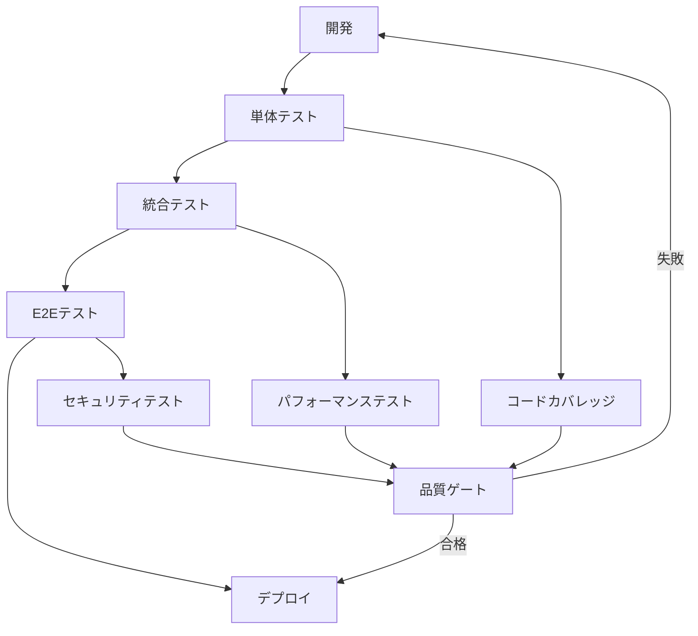

# Memory Bank System for Claude Code v2.0 - エンタープライズ版

**クリーンアーキテクチャ原則、保守可能なコード慣行、エンタープライズグレードの品質保証を備えた、Claude Code用の包括的タスク管理システム。**

---

## 🚀 クイックスタート

### 基本開発モード
1. **VAN** - プロジェクト初期化と複雑度分析
2. **PLAN** - アーキテクチャ重視の戦略的実装計画
3. **CREATIVE** - 設計決定とアーキテクチャ探索
4. **IMPLEMENT** - TDDによるクリーンコード実装
5. **REFLECT** - コードレビューと品質評価
6. **ARCHIVE** - ドキュメント化と知識保存

### 🏃‍♂️ TURBOモード（一気通貫実行）
完全な開発ワークフローを自動実行：
```
TURBO [タスク説明]
```

### 🧹 CLEANモード（コード品質特化）
コード品質改善専用モード：
```
CLEAN [焦点領域: architecture|testing|refactoring|documentation]
```

---

## 🏗️ クリーンアーキテクチャ＆コード品質機能

### コード品質原則の統合

#### SOLID原則の強制
- **単一責任の原則**: 各コンポーネントは変更の理由を一つだけ持つ
- **開放閉鎖の原則**: 拡張に対して開いていて、修正に対して閉じている
- **リスコフの置換原則**: 派生クラスは置換可能でなければならない
- **インターフェース分離の原則**: クライアントは不要なインターフェースに依存すべきでない
- **依存関係逆転の原則**: 抽象に依存し、具象に依存しない

#### クリーンコード標準
- **意味のある名前**: 明確で検索可能、発音可能な命名
- **関数設計**: 小さく、単一目的の関数（説明的な名前付き）
- **コメントガイドライン**: 自己説明的コードと最小限のコメント
- **エラーハンドリング**: ロジックを曖昧にしない適切な例外処理
- **一貫したフォーマット**: 自動化されたフォーマットとスタイル一貫性

#### アーキテクチャパターン
- **ドメイン駆動設計**: 明確なドメイン境界とユビキタス言語
- **ヘキサゴナルアーキテクチャ**: ビジネスロジックの外部関心事からの分離
- **CQRS/イベントソーシング**: 適切な場合の読み取り/書き込み操作の分離
- **リポジトリパターン**: データアクセスロジックの抽象化
- **ファクトリパターン**: オブジェクト作成のカプセル化

### テスト戦略の統合

#### テスト駆動開発（TDD）
- **Red-Green-Refactorサイクル**: 失敗テスト → 実装 → リファクタリング
- **テストファーストアプローチ**: テストが設計と実装を駆動
- **リファクタリングの安全性**: 包括的テストカバレッジによる安全なリファクタリング

#### テストピラミッド
```
    E2Eテスト（少数）
   ┌─────────────┐
  統合テスト（適度）
 ┌───────────────────┐
単体テスト（多数）
┌─────────────────────────┐
```

- **単体テスト**: 高速、分離、ビジネスロジックカバー
- **統合テスト**: コンポーネント相互作用の検証
- **E2Eテスト**: ユーザージャーニーの検証

#### テスト品質標準
- **AAAパターン**: Arrange → Act → Assert
- **説明的テスト名**: 明確な意図と期待される動作
- **テストの独立性**: テスト依存関係や共有状態なし
- **モック戦略**: 外部依存関係の戦略的モック使用

### コード品質メトリクス

#### 静的解析統合
- **コードカバレッジ**: クリティカルパスで最低80%
- **循環的複雑度**: 関数あたり最大10
- **コード重複**: 最大3%の重複率
- **技術的負債**: 追跡され優先順位付けされた解決

#### パフォーマンス考慮事項
- **ビッグO分析**: アルゴリズム複雑度の文書化
- **メモリ管理**: 適切なリソースクリーンアップと最適化
- **キャッシュ戦略**: 頻繁にアクセスされるデータの賢いキャッシュ
- **データベース最適化**: クエリ最適化とインデックス戦略

---

## 🎯 複雑度ベースワークフロー

### レベル1: クイックフィックス（バグ修正）
**ワークフロー**: VAN → IMPLEMENT → REFLECT
- **焦点**: 包括的テストによる最小侵襲的変更
- **品質ゲート**: 単体テスト、回帰テスト、コードレビュー
- **ドキュメント**: 最小限だが明確な変更ドキュメント

### レベル2: 機能拡張（機能の拡張）
**ワークフロー**: VAN → PLAN → IMPLEMENT → REFLECT → ARCHIVE
- **焦点**: 機能追加時の既存アーキテクチャ維持
- **品質ゲート**: 統合テスト、パフォーマンス検証、互換性チェック
- **アーキテクチャレビュー**: 変更が既存パターンと一致することを確認

### レベル3: 新機能開発（新機能）
**ワークフロー**: VAN → PLAN → CREATIVE → IMPLEMENT → REFLECT → ARCHIVE
- **焦点**: 適切な抽象層を持つクリーンな実装
- **品質ゲート**: 完全テストスイート、アーキテクチャレビュー、セキュリティ評価
- **デザインパターン**: 保守性のための適切なデザインパターン適用

### レベル4: システム拡張（大規模変更）
**ワークフロー**: VAN → PLAN → CREATIVE → IMPLEMENT → REFLECT → ARCHIVE
- **焦点**: 完全ドキュメント付きエンタープライズグレード実装
- **品質ゲート**: パフォーマンスベンチマーク、スケーラビリティテスト、セキュリティ監査
- **アーキテクチャ進化**: システム全体への影響と将来の拡張性を考慮

---

## 🔧 CLEANモード仕様

### アーキテクチャ焦点（`CLEAN architecture`）
- **レイヤ分離**: プレゼンテーション、ビジネス、データレイヤ間の明確な境界
- **依存関係分析**: 依存関係の見直しと最適化
- **インターフェース設計**: コンポーネント間の明確な契約定義
- **抽象化レビュー**: 抽象化レベルと複雑度の評価

### テスト焦点（`CLEAN testing`）
- **テストカバレッジ分析**: カバレッジギャップの特定と対処
- **テスト品質レビュー**: テストの保守性と明確性評価
- **テスト戦略**: テストピラミッドと実行速度の最適化
- **モック使用レビュー**: モック戦略の効果評価

### リファクタリング焦点（`CLEAN refactoring`）
- **コード臭い検出**: 一般的なアンチパターンの特定と対処
- **抽出機会**: メソッド、クラス、インターフェースの抽出
- **簡素化**: 機能維持しながらの複雑度削減
- **パフォーマンス最適化**: パフォーマンスボトルネックの特定と対処

### ドキュメント焦点（`CLEAN documentation`）
- **APIドキュメント**: 包括的インターフェースドキュメント
- **アーキテクチャ決定記録**: 重要なアーキテクチャ選択の文書化
- **コードコメント**: インラインドキュメントの見直しと改善
- **知識移転**: チームメンバーへの知識移転可能性確保

---

## 🧪 テスト＆品質保証

### 自動テスト統合


### 品質ゲート
- **コードカバレッジ**: 異なるテストタイプの最低閾値
- **パフォーマンスベンチマーク**: レスポンス時間とスループット要件
- **セキュリティスキャン**: 脆弱性評価と依存関係監査
- **コード品質メトリクス**: 複雑度、重複、保守性スコア

### 継続的インテグレーション
- **プリコミットフック**: コードフォーマット、リント、基本テスト
- **ビルドパイプライン**: 自動テストと品質チェック
- **デプロイゲート**: 本番デプロイ前の品質検証
- **監視**: ランタイム品質メトリクスとエラー追跡

---

## 📁 プロジェクト構造標準

### クリーンアーキテクチャ構造
```
project/
├── src/
│   ├── domain/          # ビジネスロジック（エンティティ、ユースケース）
│   ├── application/     # アプリケーションサービスとインターフェース
│   ├── infrastructure/  # 外部依存関係（DB、API）
│   └── presentation/    # コントローラー、ビュー、API
├── tests/
│   ├── unit/           # 単体テスト
│   ├── integration/    # 統合テスト
│   └── e2e/           # エンドツーエンドテスト
├── docs/
│   ├── architecture/   # アーキテクチャドキュメント
│   ├── api/           # APIドキュメント
│   └── decisions/     # アーキテクチャ決定記録
└── tools/
    ├── scripts/       # ビルドとデプロイスクリプト
    └── config/        # 設定ファイル
```

### ファイル組織原則
- **単一責任**: ファイルごとに一つのクラス、明確な命名
- **論理的グループ化**: 関連コンポーネントは同じディレクトリ
- **関心の分離**: レイヤ間の明確な境界
- **発見可能性**: 直感的なナビゲーションとファイル配置

---

## 🛡️ セキュリティ＆保守性

### セキュリティベストプラクティス
- **入力検証**: すべての入力の包括的検証
- **認証・認可**: 適切なアクセス制御実装
- **データ保護**: 保存時と転送時の機密データ暗号化
- **依存関係セキュリティ**: サードパーティ依存関係の定期的セキュリティ監査

### 長期保守性
- **コード可読性**: 明確な意図を持つ自己文書化コード
- **一貫したパターン**: コードベース全体で確立されたパターンの遵守
- **リファクタリングサポート**: 安全なリファクタリングをサポートするコード構造
- **知識移転**: チーム知識共有を可能にするドキュメントとコード

### 技術的負債管理
- **負債の特定**: 技術的負債の定期的評価
- **優先順位付け**: リスクベースの負債解決優先順位付け
- **追跡**: 負債蓄積と解決の可視性
- **予防**: 負債蓄積を防ぐ慣行

---

## 📊 メトリクス＆監視

### コード品質メトリクス
- **循環的複雑度**: 関数とクラスの複雑度測定
- **コードカバレッジ**: コンポーネント別テストカバレッジ率
- **重複**: コード重複率とホットスポット
- **保守性指数**: コードベース全体の保守性スコア

### パフォーマンスメトリクス
- **レスポンス時間**: APIとユーザインタラクションのレスポンス時間
- **スループット**: リクエスト処理能力
- **リソース使用量**: メモリとCPU使用率パターン
- **エラー率**: エラー頻度と分類

### 開発メトリクス
- **リードタイム**: 要件から本番まで時間
- **デプロイ頻度**: リリース頻度と信頼性
- **平均復旧時間**: インシデントからの復旧時間
- **変更失敗率**: 問題を引き起こすデプロイの割合

---

## 🔄 ワークフロー例

### 例1: バグ修正（レベル1）
```
1. VAN - バグレポートとコードベース影響分析
2. IMPLEMENT - 包括的テスト付き最小修正適用
3. REFLECT - 修正効果と副作用の検証
```

### 例2: 機能拡張（レベル2）
```
1. VAN - 機能要件と統合ポイント評価
2. PLAN - アーキテクチャ維持の拡張戦略設計
3. IMPLEMENT - 適切なテスト付き機能開発
4. REFLECT - 実装品質とパフォーマンスレビュー
5. ARCHIVE - 機能と統合ポイントの文書化
```

### 例3: 新機能（レベル3）
```
1. VAN - 要件とアーキテクチャ影響分析
2. PLAN - 機能アーキテクチャと依存関係設計
3. CREATIVE - 設計代替案とパターン探索
4. IMPLEMENT - クリーンアーキテクチャに従った機能構築
5. REFLECT - 包括的品質レビュー
6. ARCHIVE - 完全なドキュメントと知識移転
```

### 例4: システム拡張（レベル4）
```
1. VAN - エンタープライズレベル分析とステークホルダー調整
2. PLAN - 包括的実装戦略
3. CREATIVE - アーキテクチャ探索と決定文書化
4. IMPLEMENT - 品質ゲート付き段階的実装
5. REFLECT - システム全体影響評価
6. ARCHIVE - エンタープライズドキュメントと研修資料
```

---

## 🚀 はじめ方

### 1. プロジェクトセットアップ
```bash
# システムファイルをプロジェクトにコピー
cp -r claude-code-enhanced/jp/.cursor .
cp -r claude-code-enhanced/jp/memory_bank .
cp claude-code-enhanced/jp/CLAUDE.md .
```

### 2. 開発初期化
```
VAN
```

### 3. ワークフロー選択
- **高速開発**: TURBOモード使用
- **品質重視**: 標準モード進行使用
- **コード改善**: CLEANモード使用

### 4. 品質検証
```
# 品質チェック実行
npm run lint
npm run test
npm run coverage
```

---

## 🔧 設定

### 品質ゲート設定
```json
{
  "coverage": {
    "minimum": 80,
    "critical_paths": 95
  },
  "complexity": {
    "max_cyclomatic": 10,
    "max_function_length": 50
  },
  "performance": {
    "max_response_time": 200,
    "min_throughput": 1000
  }
}
```

### テスト設定
```json
{
  "testing": {
    "unit_test_pattern": "**/*.test.js",
    "integration_test_pattern": "**/*.integration.test.js",
    "e2e_test_pattern": "**/*.e2e.test.js",
    "coverage_threshold": 80
  }
}
```

---

## 📚 ベストプラクティス要約

### 開発慣行
1. **テスト駆動開発**: 実装前にテストを書く
2. **クリーンコード**: クリーンコード原則の一貫した遵守
3. **定期的リファクタリング**: 継続的コード改善
4. **コードレビュー**: 品質保証のためのピアレビュー

### アーキテクチャ慣行
1. **依存関係逆転**: 実装ではなくインターフェースにプログラム
2. **単一責任**: 各コンポーネントは変更の理由を一つだけ持つ
3. **開放閉鎖原則**: 拡張に対して開いて、修正に対して閉じる
4. **インターフェース分離**: 小さく、焦点を絞ったインターフェース

### 品質慣行
1. **自動テスト**: 包括的テスト自動化
2. **継続的インテグレーション**: 自動品質検証
3. **静的解析**: 自動コード品質評価
4. **パフォーマンス監視**: ランタイム品質メトリクス

### ドキュメント慣行
1. **自己文書化コード**: その目的を説明するコード
2. **APIドキュメント**: 明確なインターフェースドキュメント
3. **アーキテクチャ決定**: 重要な選択の文書化
4. **知識共有**: 効果的な知識移転

---

**Memory Bank System v2.0 エンタープライズ版** - Claude Codeで保守可能、スケーラブル、高品質なソフトウェアを構築。